# 114 應用軟體實習－期末專題報告

## 基本資料
專題名稱：Simplest Book Android 極簡記帳

組長：孫培鈞 電子三甲 112360104

組員：方宇澤 光電四 111650037

---

## 一、專題動機（5 分）

因記帳為日常中需要一直執行的內容，就像是過捷運閘門一樣，大家永遠都在思考要如何越簡單、越快速最好。市面上的記帳軟體卻常常有很多複雜的附加功能，造成這個小動作變得很麻煩，因此有了此專案的前身 - [`SimeplestBookkeepingPWA`](https://github.com/Dao-you/SimplestBookkeepingPWA)，它是使用 Python flask 撰寫的 PWA App，以伺服器端儲存為核心運作。

但是網頁應用程式仍然有不少缺點，首先是雖然已經做了本地介面快取，也做了可以安裝在桌面的措施，但在手機上受限於瀏覽器沒辦法常駐在背景運作，所以開啟的速度還是很慢，並且資料寫入基於網路請求，常常也需要等一段時間，在網路不穩定的地方例如電梯進出，還常常會失敗。

因此我們希望基於同樣的設計理念，設計一個 Android 原生應用程式的版本，用同樣最簡化流程的方法，改善以上缺點。並且增加背景雲端備份，承襲伺服器端儲存的優點，也更可以推廣給所有人使用，不須要自己先架設一台網頁伺服器。

---

## 二、小組分工（5 分）

請說明小組成員的分工內容，可使用條列方式說明每位成員負責的項目。

- 成員一：Dao-you 孫培鈞 電子三甲 112360104
    1. 資料處理程式設計

- 成員二：terry 方宇澤 光電四 111650037
    1. 介面 Layout 設計

Branch Neteork 圖 (待更新)


---

## 三、系統流程圖（10 分）

1. 整體運作流程

    ```mermaid
    flowchart TD
        A[使用者開啟主畫面] --> B[輸入金額與備註]
        B --> C{選擇類別方式}
        C -->|手動選擇| D[可選類別 GridView]
        C -->|自動分類| E[先以「其他」存入]
        D --> F[定位預擷取/取得座標]
        E --> F
        F --> G[寫入 SQLite]
        G --> H[觸發雲端同步]
        H --> I{是否自動進歷史頁}
        I -->|是| J[顯示歷史清單]
        I -->|否| K[留在主畫面等待下一筆]
        E --> L[啟動 AutoCategoryService]
        L --> M[API 自動分類]
        M --> N[更新 SQLite 類別]
        N --> O[廣播通知 UI]
        O --> J
        P[使用者離開 App] --> Q[啟動 StatusChipService]
        Q --> R[Overlay 顯示總額]
    ```

1. 週期性付款功能運作流程

    ```mermaid
    flowchart TD
        A[進入週期性付款頁] --> B[新增/編輯週期性項目]
        B --> C[寫入 SQLite recurring_payments]
        C --> D[排程 WorkManager 每日檢查]
        C --> E[排程 AlarmManager 每分鐘模式]
        D --> F[到期判斷]
        F --> G[自動新增記帳紀錄]
        G --> H[發送通知]
        E --> I[每分鐘觸發]
        I --> G
    ```
    
1. 雲端備份功能運作流程

    ```mermaid
    flowchart TD
        A[啟用雲端備份] --> B[Google 登入]
        B --> C[同步觸發]
        C --> D[讀取 SQLite 記帳/類別/週期性]
        D --> E[上傳 Firestore]
        E --> F[驗證筆數]
        F --> G[更新同步狀態]
        H[手動還原] --> I[讀取 Firestore 最新備份]
        I --> J[覆蓋/加入 SQLite]
        J --> K[重新排程週期性工作]
    ```

---

## 四、程式介紹（5 分）

以下依 `.java` 檔案說明其功能、主要方法/流程、資料來源與對應 UI，並附上 Mermaid 圖表：

### `SimplestBookApplication.java`
- 功能：App 入口點，啟動時套用動態 Material 色彩到所有 Activity。
- 主要方法：`onCreate()`
- 資料/資源：無直接資料存取，僅進行 UI 主題初始化。
```mermaid
flowchart TD
    A[App 啟動] --> B[onCreate()]
    B --> C[DynamicColors.applyToActivitiesIfAvailable]
```

### `MainActivity.java`
- 功能：主畫面輸入金額與備註、選擇類別、儲存記帳，並可進入歷史、設定與週期性付款。
- 主要 UI：`amountInput`, `noteInput`, `categoryGrid`, `saveButton`, `topAppBar`, `recurringFab`
- 主要流程：
  1. `loadCategories()` 從 SQLite 載入類別並補入「其他」。
  2. `saveRecord()` 驗證輸入，取得類別後進入定位流程。
  3. `performDatabaseSave()` 背景寫入 SQLite，呼叫雲端同步。
  4. 若預設類別為自動，`saveWithPlaceholderThenAutoSelect()` 先存「其他」再啟動 `AutoCategoryService`。
  5. `checkPermission()` 申請定位權限；`prefetchLocation()` 預先抓取座標。
  6. `onUserLeaveHint()`/返回鍵觸發 `StatusChipService` 顯示離開時總額。
- 資料來源：`DatabaseHelper`、`SharedPreferences`、`FusedLocationProviderClient`
- 版面資源：`activity_main.xml`
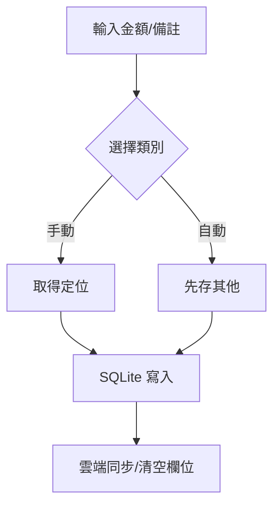

### `HistoryActivity.java`
- 功能：顯示歷史清單與總額、提供 CSV 匯入/匯出/分享、接收自動分類更新廣播。
- 主要 UI：`historyListView`, `totalAmountText`, `cardTotal`, `historyToolbar`, `fabAdd`
- 主要流程：
  1. `loadRecords()` 背景讀取 SQLite，計算總額並更新 ListView。
  2. `recordUpdatedReceiver` 接收廣播後重新載入並動畫提示。
  3. `exportToFile()`/`shareByCsv()` 產出 CSV；`importFromCsv()` 可 Append/Overwrite。
- 資料來源：`DatabaseHelper`、`CsvHelper`
- 版面資源：`activity_history.xml`
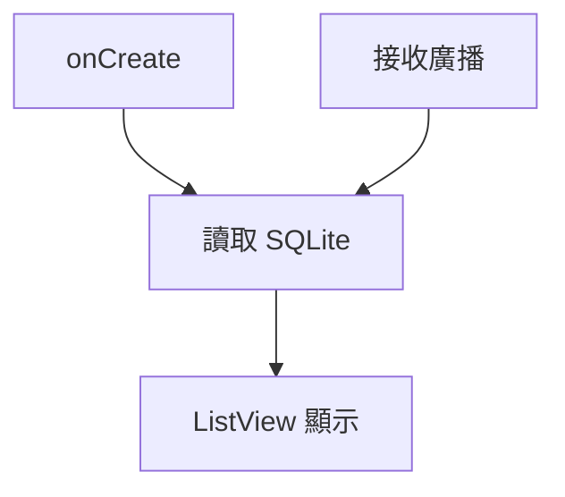

### `EditRecordActivity.java`
- 功能：編輯或刪除單筆紀錄，支援時間調整、地圖預覽、跳轉全螢幕地圖。
- 主要 UI：`editAmountInput`, `editNoteInput`, `editTimeInput`, `editCategoryGrid`, `mapContainer`
- 主要流程：
  1. 由 Intent 取得紀錄資料並填入欄位。
  2. `showDateTimePicker()` 修改時間。
  3. 若有座標則顯示地圖與地址；點擊地圖卡片開啟 `FullMapActivity`。
  4. `handlePrimaryAction()` 判斷是否變更，更新或刪除。
- 資料來源：`DatabaseHelper`、`Geocoder`
- 版面資源：`activity_edit_record.xml`
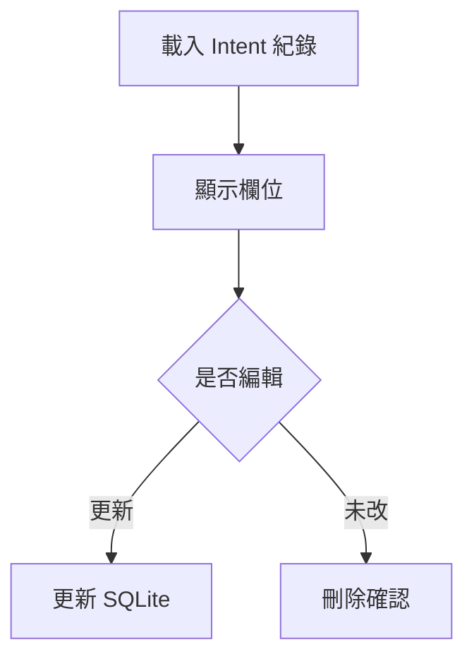

### `ChartActivity.java`
- 功能：依類別彙總金額，顯示總額/筆數/平均與條狀圖。
- 主要 UI：`totalAmountText`, `totalCountText`, `averageAmountText`, `chartContainer`
- 主要流程：
  1. `loadChart()` 背景讀取 SQLite，分類加總。
  2. 依金額排序後 `renderChart()` 建立每個類別的進度條與數值。
- 資料來源：`DatabaseHelper`
- 版面資源：`activity_chart.xml`, `item_chart_bar.xml`
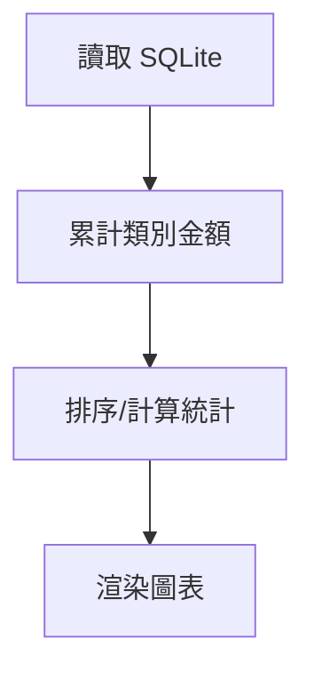

### `FullMapActivity.java`
- 功能：顯示記帳位置的全螢幕地圖，可編輯地點備註。
- 主要 UI：`SupportMapFragment`, `locationNameView`, `locationCard`
- 主要流程：
  1. `onMapReady()` 顯示 Marker 與相機縮放。
  2. 點擊地點文字或卡片開啟 Dialog 修改備註並寫回 SQLite。
- 資料來源：`DatabaseHelper`
- 版面資源：`activity_full_map.xml`
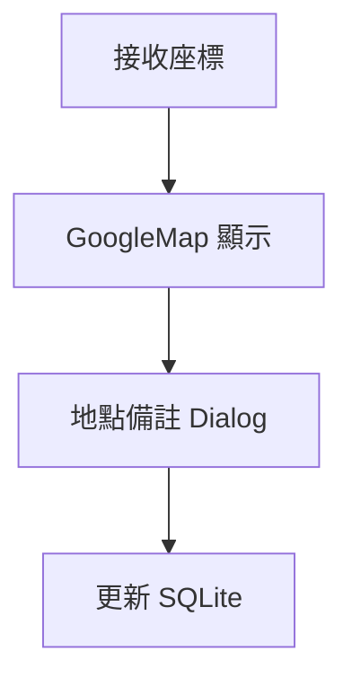

### `SettingsActivity.java`
- 功能：設定定位/主題/自動分類 API、雲端備份、Google 登入、週期性通知。
- 主要 UI：多個 `MaterialSwitch`、API Key/URL 輸入框、雲端備份與還原按鈕。
- 主要流程：
  1. `SharedPreferences` 讀寫使用者設定。
  2. Google 登入後才可啟用雲端備份與手動同步。
  3. 設定 API Key/URL 以啟用自動分類。
- 資料來源：`SharedPreferences`、`FirebaseAuth`、`GoogleSignInClient`
- 版面資源：`activity_settings.xml`
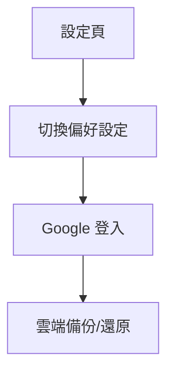

### `StatusChipService.java`
- 功能：使用 Overlay View 顯示離開 App 的總額提示。
- 主要流程：
  1. 檢查 Overlay 權限。
  2. 背景讀取 `DatabaseHelper.getTotalAmount()`。
  3. 用 `WindowManager` 顯示視窗並自動淡出。
- 資料來源：`DatabaseHelper`
- 版面資源：`activity_status_chip.xml`
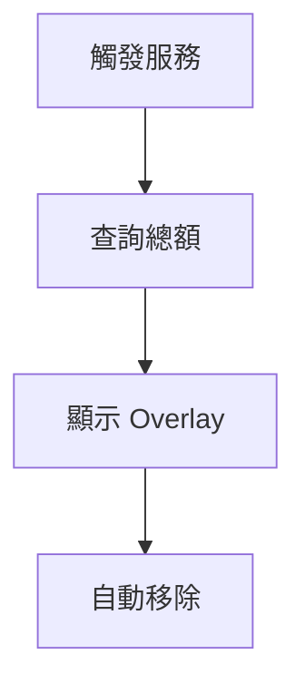

### `AutoCategoryService.java`
- 功能：背景呼叫 AI 自動分類，更新資料庫後透過廣播通知 UI。
- 主要流程：
  1. 從 `SharedPreferences` 讀取 API Key/URL。
  2. `AutoCategoryClient.requestAutoCategory()` 取得類別。
  3. 更新 SQLite、觸發雲端同步並送出廣播。
- 資料來源：`AutoCategoryClient`、`DatabaseHelper`
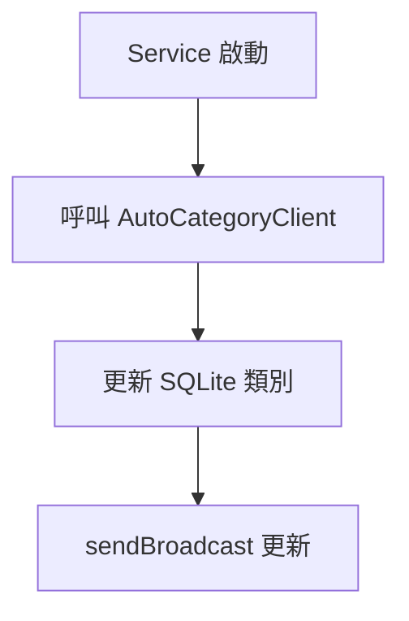

### `AutoCategoryClient.java`
- 功能：封裝 OpenAI/GitHub Models API 請求、模型 fallback 與回應解析。
- 主要流程：
  1. `normalizeApiUrl()` 與 `normalizeToken()` 統一 API 格式。
  2. `requestOnce()` 送出 HTTP 請求。
  3. 判斷 invalid model 時切換備援模型重試。
  4. `parseCategoryFromResponse()` 解析 JSON 取得類別。
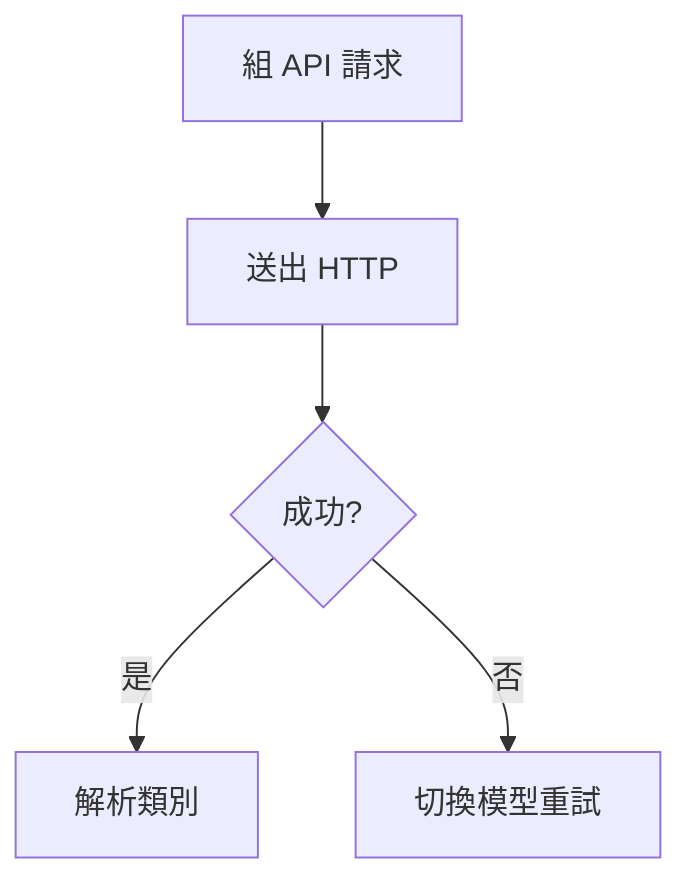

### `ManageCategoriesActivity.java`
- 功能：新增/刪除/拖曳排序類別。
- 主要 UI：`RecyclerView` 類別清單、輸入欄位與新增按鈕。
- 主要流程：
  1. `loadCategories()` 讀取 SQLite 類別。
  2. `ItemTouchHelper` 實作拖曳排序。
  3. 刪除類別時彈窗確認。
- 資料來源：`DatabaseHelper`
- 版面資源：`activity_manage_categories.xml`
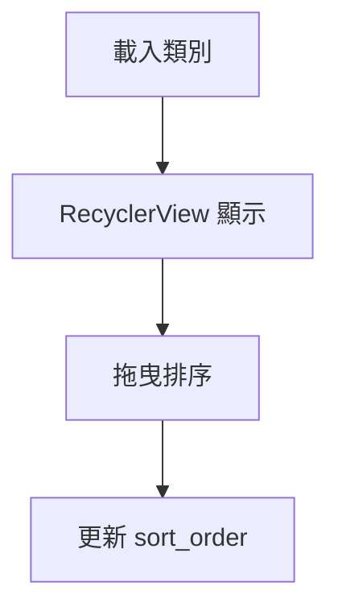

### `Category.java`
- 功能：類別資料模型，保存 id 與名稱。
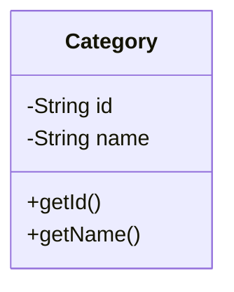

### `CategoryAdapter.java`
- 功能：GridView 類別卡片 Adapter，依選取狀態改變顏色與框線。
- 主要流程：`getView()` 設定文字與 Material 色彩。
- 版面資源：`item_category.xml`
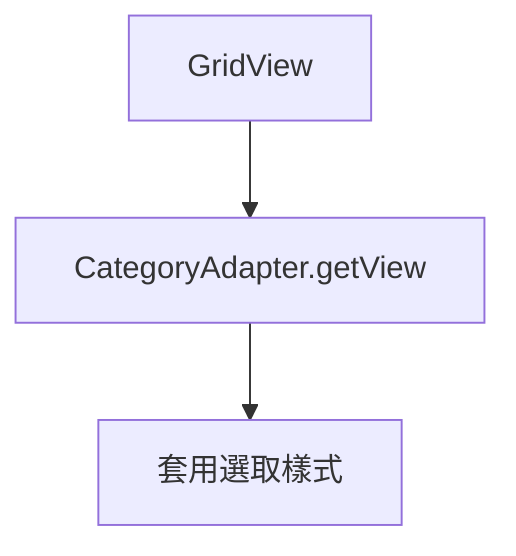

### `Record.java`
- 功能：記帳資料模型（金額、類別、備註、時間、座標等）。
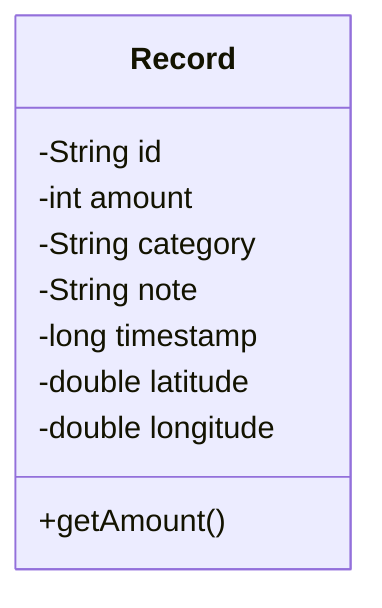

### `RecordAdapter.java`
- 功能：ListView Adapter，格式化時間顯示（剛剛/今天/昨天/一週內）。
- 主要流程：`formatTime()` 依時間差輸出相對時間字串。
- 版面資源：`item_record.xml`
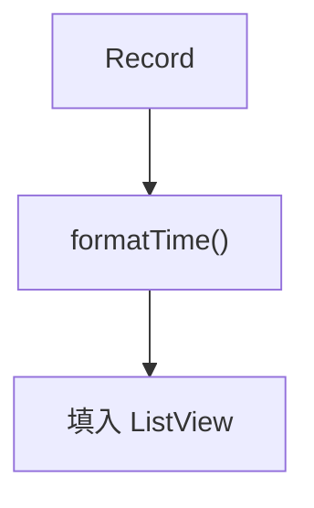

### `DatabaseHelper.java`
- 功能：SQLiteOpenHelper，建立三張表與 CRUD（records/categories/recurring）。
- 主要流程：
  1. `onCreate()` 建表並 `seedCategories()`。
  2. 提供 insert/update/delete/query 方法。
  3. `getTotalAmount()` 用於退出時總額提示。
- 資料來源：SQLite
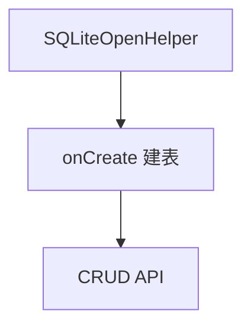

### `CsvHelper.java`
- 功能：CSV 匯出/匯入與分享，支援地址文字與地理座標互轉。
- 主要流程：
  1. `generateCsvContent()` 產出 CSV。
  2. `importCsv()` 解析 CSV 並補上經緯度。
  3. `shareCsv()`/`writeCsvToUri()` 進行分享或儲存。
- 資料來源：`Geocoder`、`FileProvider`
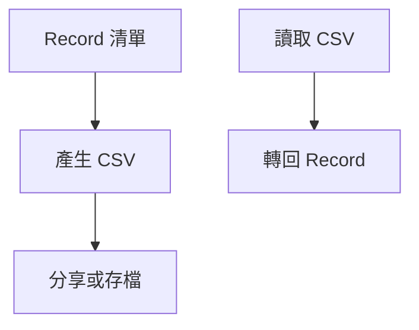

### `CloudBackupIndicator.java`
- 功能：監聽雲端備份狀態，更新 Toolbar icon 與 Snackbar。
- 主要流程：`register()` 監聽偏好變化、`showStatusSnackbar()` 顯示狀態訊息。
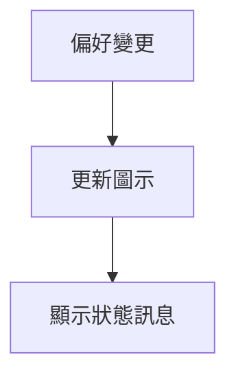

### `CloudBackupManager.java`
- 功能：Firestore 同步/還原與狀態驗證。
- 主要流程：
  1. `syncNow()` 讀 SQLite 並上傳 Firestore。
  2. `restoreFromCloud()` 下載並回寫本地資料。
  3. `verifyPendingSync()` 驗證筆數確保同步成功。
- 資料來源：`FirebaseAuth`、`FirebaseFirestore`、`DatabaseHelper`
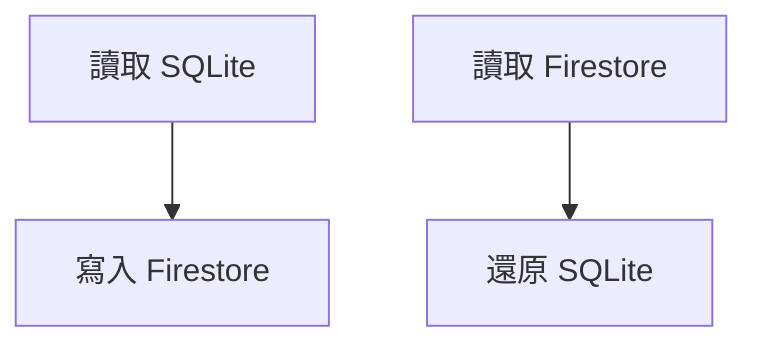

### `RecurringPayment.java`
- 功能：週期性付款資料模型與頻率常數。
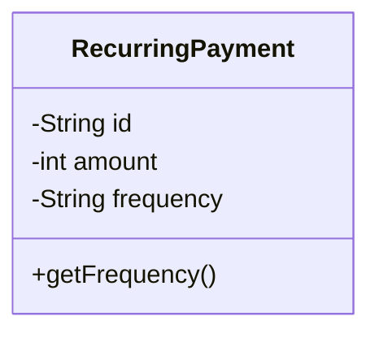

### `RecurringPaymentActivity.java`
- 功能：週期性付款清單頁，新增/編輯/刪除所有。
- 主要流程：`loadRecurringList()` 讀取 SQLite 並更新 ListView。
- 版面資源：`activity_recurring_payment.xml`
```mermaid
flowchart TD
    A[讀取 recurring] --> B[ListView 顯示]
    B --> C[點擊進編輯]
```

### `RecurringPaymentAdapter.java`
- 功能：週期性付款清單 Adapter，組合標題與頻率顯示文字。
- 主要流程：`formatSchedule()` 依頻率組字。
```mermaid
flowchart TD
    A[RecurringPayment] --> B[formatSchedule]
    B --> C[顯示於 ListView]
```

### `RecurringPaymentEditActivity.java`
- 功能：新增/編輯週期性付款，依頻率顯示不同輸入元件。
- 主要流程：
  1. `setupFrequencyGroup()` 切換週期輸入區。
  2. `save()` 寫入 SQLite，排程 Work/Alarm。
  3. `handlePrimaryAction()` 依是否編輯決定更新或刪除。
- 版面資源：`activity_recurring_payment_edit.xml`
```mermaid
flowchart TD
    A[輸入金額/類別] --> B[選擇頻率]
    B --> C[寫入 SQLite]
    C --> D[排程 Work/Alarm]
```

### `RecurringPaymentWorker.java`
- 功能：WorkManager 每日檢查是否到期，自動新增記帳並通知。
- 主要流程：讀取 recurring -> 判斷是否到期 -> 新增記帳 -> 發通知。
```mermaid
flowchart TD
    A[每日觸發] --> B[檢查到期]
    B --> C[新增紀錄]
    C --> D[通知]
```

### `RecurringPaymentAlarmReceiver.java`
- 功能：AlarmManager 每分鐘觸發（Minute 模式），新增紀錄並排程下一次。
- 主要流程：
  1. `scheduleAllMinute()` 找出 minute 項目並排程。
  2. `onReceive()` 寫入紀錄、通知、再排程。
```mermaid
flowchart TD
    A[Alarm 觸發] --> B[新增紀錄]
    B --> C[通知]
    C --> D[排程下一次]
```

---

## 五、結果展示（5 分）

展示實際執行成果與畫面截圖（可依下列項目插入圖片）：
- 主畫面：輸入金額、備註，類別 Grid 選擇與儲存。
- 歷史清單：總額卡片、ListView 列表、CSV 匯出/匯入入口。
- 編輯紀錄：時間修改、類別切換、地圖預覽。
- 圖表統計：類別長條圖、總額/筆數/平均。
- 週期性付款：清單與編輯頁。
- 設定頁：雲端備份、Google 登入、API 設定。
- 退出時狀態提示：Overlay 顯示累計金額。

---


## 六、使用課堂上所學技術說明

以下重新整理技術分類，補上使用位置、觸發流程與上下文說明。

### （一）使用到的外部 API 技術（10 分）

- API 名稱：OpenAI API（亦支援 GitHub Models URL）
- 使用位置：AutoCategoryClient.java、AutoCategoryService.java
- 觸發流程：主畫面存檔且預設類別為「自動」。
  → 先存「其他」再由服務呼叫 API。
- 程式碼（服務呼叫 + API 請求）：
```java
// AutoCategoryService.java
String selected = AutoCategoryClient.requestAutoCategory(
        prefs, apiKey, apiUrl, amount, note, optionList);
```
```java
// AutoCategoryClient.java
connection.setRequestProperty("Authorization", "Bearer " + token);
body.addProperty("model", model);
```
- 說明：API 回傳 JSON 後解析類別；若模型不可用會自動切換。

---

### （二）課堂技術一：Broadcast 發送與接收

- 使用位置：AutoCategoryService.java、HistoryActivity.java
- 觸發流程：背景分類完成後送廣播，歷史頁收到後重讀資料。
- 程式碼（發送 + 接收）：
```java
// AutoCategoryService.java
Intent updateIntent = new Intent(AutoCategoryService.ACTION_RECORD_UPDATED);
sendBroadcast(updateIntent);
```
```java
// HistoryActivity.java
IntentFilter filter = new IntentFilter(AutoCategoryService.ACTION_RECORD_UPDATED);
ContextCompat.registerReceiver(this, recordUpdatedReceiver, filter, ContextCompat.RECEIVER_NOT_EXPORTED);
```
- 說明：廣播避免 UI 忙碌輪詢，且可精準更新單筆。

---

### （三）課堂技術二：SQLiteOpenHelper

- 使用位置：DatabaseHelper.java（記帳/類別/週期性三張表）
- 觸發流程：存檔、編輯、刪除、匯入皆呼叫 CRUD。
- 程式碼（建表 + 寫入）：
```java
// DatabaseHelper.java
db.execSQL(TABLE_RECORDS_CREATE);
db.execSQL(TABLE_CATEGORIES_CREATE);
```
```java
// MainActivity.java
dbHelper.insertRecord(amount, category, note, "", System.currentTimeMillis(), 0.0, 0.0);
```
- 說明：本機 SQLite 提供離線可用與快速查詢。

---

### （四）課堂技術三：ListView 與 GridView

- 使用位置：MainActivity.java（GridView）、HistoryActivity.java（ListView）
- 觸發流程：載入資料後綁定 Adapter，點擊項目觸發行為。
- 程式碼：
```java
// MainActivity.java
categoryGrid.setAdapter(categoryAdapter);
```
```java
// HistoryActivity.java
historyListView.setAdapter(adapter);
```
- 說明：Grid 顯示類別，List 顯示記帳與週期性項目。

---

### （五）課堂技術四：Google Map 與定位

- 使用位置：MainActivity.java（定位）、FullMapActivity.java（地圖）
- 觸發流程：存檔時取得座標；編輯頁/地圖頁顯示 Marker。
- 程式碼：
```java
// MainActivity.java
fusedLocationClient.getCurrentLocation(Priority.PRIORITY_HIGH_ACCURACY, null)
        .addOnSuccessListener(location -> { ... });
```
```java
// FullMapActivity.java
googleMap.addMarker(new MarkerOptions().position(location).title("位置"));
```
- 說明：定位寫入紀錄，地圖提供位置視覺化。

---

### （六）課堂技術五：Activity 與 Intent 導航

- 使用位置：MainActivity.java、HistoryActivity.java、EditRecordActivity.java
- 觸發流程：依使用者操作切換頁面並傳遞紀錄欄位。
- 程式碼：
```java
// HistoryActivity.java
Intent intent = new Intent(this, EditRecordActivity.class);
intent.putExtra("id", selectedRecord.getId());
startActivity(intent);
```
- 說明：Intent 內攜帶資料，避免重複查詢。

---

### （七）課堂技術六：Service（背景任務）

- 使用位置：AutoCategoryService.java、StatusChipService.java
- 觸發流程：存檔後自動分類、離開 App 顯示總額。
- 程式碼：
```java
// AutoCategoryService.java
context.startService(intent);
```
```java
// StatusChipService.java
showOverlay(total);
```
- 說明：服務讓耗時工作不阻塞 UI。

---

### （八）課堂技術七：Toast / Dialog

- 使用位置：MainActivity.java、HistoryActivity.java、EditRecordActivity.java
- 觸發流程：輸入驗證、刪除確認、匯入結果提示。
- 程式碼：
```java
// MainActivity.java
Toast.makeText(this, "請輸入金額", Toast.LENGTH_SHORT).show();
```
```java
// EditRecordActivity.java
new MaterialAlertDialogBuilder(this)
        .setTitle("確認刪除")
        .setPositiveButton("刪除", (dialog, which) -> { ... })
```
- 說明：Toast 提示操作結果，Dialog 用於不可逆操作確認。

---

## 七、使用課外延伸技術說明

### （一）課外技術一：Overlay View

- 使用位置：StatusChipService.java
- 使用情境：使用者離開 App 時短暫顯示總額。
- 程式碼：
```java
windowManager.addView(overlayView, params);
```
- 說明：使用系統層視窗，離開也能顯示。

---

### （二）課外技術二：Firebase + Google Auth

- 使用位置：SettingsActivity.java、CloudBackupManager.java
- 使用情境：使用者啟用雲端備份並登入 Google。
- 程式碼：
```java
firebaseAuth.signInWithCredential(GoogleAuthProvider.getCredential(account.getIdToken(), null));
```
```java
FirebaseFirestore.getInstance().collection("users").document(uid)
        .collection("backups").document("latest").set(payload);
```
- 說明：登入驗證身份後才能同步/還原資料。

---

### （三）課外技術三：WorkManager + AlarmManager

- 使用位置：RecurringPaymentWorker.java、RecurringPaymentAlarmReceiver.java
- 使用情境：每日檢查到期；每分鐘模式用 Alarm 精準觸發。
- 程式碼：
```java
WorkManager.getInstance(context).enqueueUniquePeriodicWork(WORK_NAME, ExistingPeriodicWorkPolicy.UPDATE, request);
```
- 說明：WorkManager 穩定排程，AlarmManager 用於高頻需求。

---

### （四）課外技術四：RecyclerView + ItemTouchHelper

- 使用位置：ManageCategoriesActivity.java
- 使用情境：類別管理頁拖曳排序後立即寫回資料庫。
- 程式碼：
```java
Collections.swap(categories, fromPosition, toPosition);
dbHelper.updateCategoryOrder(categories.get(i).getId(), i);
```
- 說明：拖曳結束後更新 sort_order。

---

### （五）課外技術五：CSV 匯入/匯出 + FileProvider

- 使用位置：CsvHelper.java、HistoryActivity.java
- 使用情境：CSV 匯出分享、CSV 匯入還原資料。
- 程式碼：
```java
Uri contentUri = FileProvider.getUriForFile(activity, activity.getPackageName() + ".fileprovider", file);
```
- 說明：使用 FileProvider 安全分享檔案。

---

### （六）課外技術六：Material Components

- 使用位置：HistoryActivity.java、SettingsActivity.java 等
- 使用情境：對話框、Toolbar、Switch 等一致化 UI。
- 程式碼：
```java
new MaterialAlertDialogBuilder(this).setTitle("警告").setNegativeButton("取消", null).show();
```
- 說明：Material 元件提升一致性與可用性。

## 八、總結與心得

請說明本次期末專題的學習收穫與反思。
