# 114 應用軟體實習－期末專題報告

## 基本資料
專題名稱：Simplest Book Android 極簡記帳

組長：孫培鈞 電子三甲 112360104

組員：方宇澤 光電四 111650037

---

## 一、專題動機（5 分）

因記帳為日常中需要一直執行的內容，就像是過捷運閘門一樣，大家永遠都在思考要如何越簡單、越快速最好。市面上的記帳軟體卻常常有很多複雜的附加功能，造成這個小動作變得很麻煩，因此有了此專案的前身 - [`SimeplestBookkeepingPWA`](https://github.com/Dao-you/SimplestBookkeepingPWA)，它是使用 Python flask 撰寫的 PWA App，以伺服器端儲存為核心運作。

但是網頁應用程式仍然有不少缺點，首先是雖然已經做了本地介面快取，也做了可以安裝在桌面的措施，但在手機上受限於瀏覽器沒辦法常駐在背景運作，所以開啟的速度還是很慢，並且資料寫入基於網路請求，常常也需要等一段時間，在網路不穩定的地方例如電梯進出，還常常會失敗。

因此我們希望基於同樣的設計理念，設計一個 Android 原生應用程式的版本，用同樣最簡化流程的方法，改善以上缺點。並且增加背景雲端備份，承襲伺服器端儲存的優點，也更可以推廣給所有人使用，不須要自己先架設一台網頁伺服器。

---

## 二、小組分工（5 分）

請說明小組成員的分工內容，可使用條列方式說明每位成員負責的項目。

- 成員一：Dao-you 孫培鈞 電子三甲 112360104
    1. 資料處理程式設計

- 成員二：terry 方宇澤 光電四 111650037
    1. 介面 Layout 設計

Branch Neteork 圖

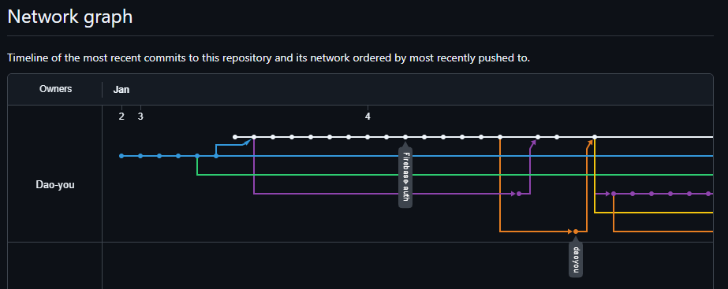

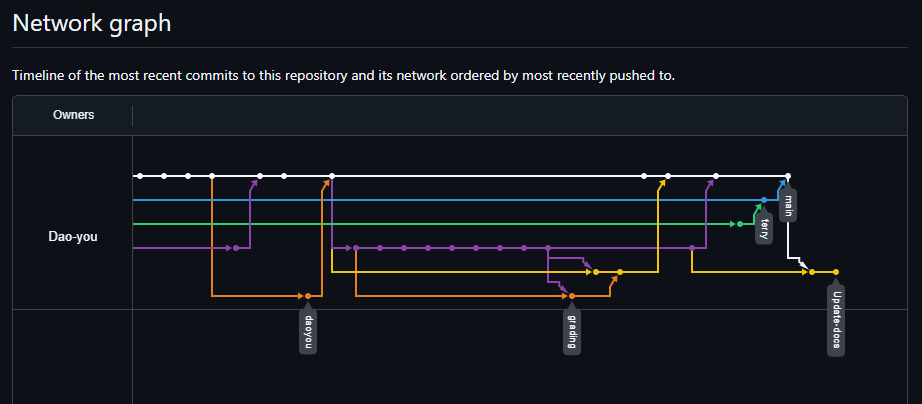

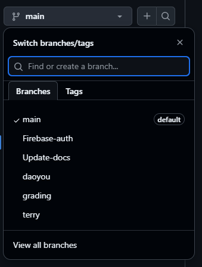


---

## 三、系統流程圖（10 分）

1. 整體運作流程

    ```mermaid
    flowchart TD
        subgraph U["使用者前景流程"]
            UA["啟動 App (SimplestBookApplication)"] --> UB["MainActivity.onCreate() 綁定 UI/偏好"]
            UB --> UC["loadCategories() 從 SQLite 載入類別"]
            UB --> UD["checkPermission() 申請定位權限"]
            UB --> UE["checkRecurringNotificationPermission() 申請通知權限"]
            UB --> UF["onResume()"]
            UF --> UG["loadCategories() 重新整理"]
            UF --> UH["prefetchLocation() 預抓座標"]
            UF --> UI["CloudBackupManager.verifyPendingSync()"]

            UJ["輸入金額/備註後送出"] --> UK["saveRecord() 驗證金額/備註"]
            UK --> UL{"類別已選?"}
            UL -->|"否且預設=自動"| UM["saveWithPlaceholderThenAutoSelect()"]
            UL -->|"否"| UN["提示請選擇類別"]
            UL -->|"是"| UO["saveRecordWithCategory()"]
            UM --> UO
            UO --> UP{"定位開啟?"}
            UP -->|"否"| UQ["以 0,0 儲存"]
            UP -->|"是"| UR{"已預抓座標?"}
            UR -->|"是"| US["使用預抓座標寫入"]
            UR -->|"否"| UT["getLastLocation() 取得/失敗 -> 0,0"]
            US --> UV["performDatabaseSave() 寫入 SQLite"]
            UT --> UV
            UQ --> UV
            UV --> UW["completeSave() 清空欄位"]
            UW --> UX{"自動跳歷史頁?"}
            UX -->|"是"| UY["開啟 HistoryActivity"]
            UX -->|"否"| UZ["留在主畫面並再預抓定位"]
            UAA["使用者離開 App/按返回"] --> UAB["StatusChipService.show()"]
        end

        subgraph B["背景/輔助服務"]
            UV --> BA["CloudBackupManager.requestSyncIfEnabled()"]
            BA --> BB["FirebaseAuth 取使用者"]
            BB --> BC{"已登入?"}
            BC -->|"是"| BD["讀取 records/categories/recurring 並上傳 Firestore"]
            BC -->|"否"| BE["更新狀態為 ERROR"]
            BD --> BF["scheduleVerify() 驗證筆數"]

            UV --> BG["(自動類別) AutoCategoryService.start()"]
            BG --> BH["AutoCategoryClient 呼叫 API"]
            BH --> BI{"回傳類別"}
            BI -->|"成功"| BJ["更新 SQLite 類別"]
            BI -->|"失敗"| BK["回退 '其他'"]
            BJ --> BL["CloudBackupManager.requestSyncIfEnabled()"]
            BK --> BL
            BL --> BM["Broadcast ACTION_RECORD_UPDATED"]
            BM --> BN["HistoryActivity 收到後重載"]

            UAB --> BO["查詢 getTotalAmount() 並顯示 Overlay"]
            UB --> BP["RecurringPaymentWorker.schedule()/AlarmReceiver.scheduleAllMinute()"]
            BP --> BQ["每日 WorkManager + 每分鐘 Alarm 插入到期紀錄"]
        end

        subgraph S["設定/權限入口"]
            SA["SettingsActivity 切換定位/預設類別/自動歷史"] --> UB
            SA --> SB["設定 Google 登入與雲端備份開關"] --> BA
            SA --> SC["填入自動分類 API Key/URL"] --> BG
        end
    ```


1. 週期性付款功能運作流程

    ```mermaid
    flowchart TD
        A["RecurringPaymentActivity 開啟"] --> B["新增/編輯項目 (RecurringPaymentEditActivity)"]
        B --> C["save() 寫入 SQLite recurring_payments"]
        C --> D{"頻率類型"}
        D -->|"daily/weekly/monthly"| E["RecurringPaymentWorker.schedule() 排 WorkManager"]
        D -->|"minute"| F["RecurringPaymentAlarmReceiver.scheduleAllMinute() 排 Alarm"]
        E --> G["每日觸發 doWork() 檢查 lastRunAt"]
        F --> H["每分鐘 onReceive() 判斷 minute 項目"]
        G --> I{"到期?"}
        H --> I
        I -->|"是"| J["insertRecordAndReturnId() 寫入紀錄"]
        J --> K["Notification 發送已新增紀錄" ]
        K --> L["CloudBackupManager.requestSyncIfEnabled() 同步"]
        I -->|"否"| M["重新排程等待下一次"]
    ```

1. 雲端備份功能運作流程

    ```mermaid
    graph LR
        subgraph Cloud["啟用與同步"]
            A["SettingsActivity 切換雲端備份 ON"] --> B["Google 登入 FirebaseAuth"]
            B --> C{"登入成功?"}
            C -->|"是"| D["CloudBackupManager.syncNow()" ]
            C -->|"否"| E["updateStatus(ERROR) 等待使用者重試"]
            D --> F["readRecords()/readCategories()/readRecurring()" ]
            F --> G["Firestore backups/latest set(payload)"]
            G --> H["scheduleVerify() 依筆數驗證" ]
            H --> I{"筆數符合?"}
            I -->|"是"| J["updateStatus(SUCCESS)" ]
            I -->|"否"| K["重試驗證或標記 ERROR"]
        end
        subgraph Restore["還原流程"]
            L["使用者點擊手動還原"] --> M["restoreFromCloud() 下載最新備份"]
            M --> N{"資料存在?"}
            N -->|"有"| O["背景執行 restoreRecords()/restoreCategories()/restoreRecurring()" ]
            O --> P["updateStatus(SUCCESS) 並回呼 UI" ]
            P --> Q["重新排程 WorkManager/Alarm"]
            N -->|"無"| R["updateStatus(ERROR: empty backup)"]
        end
    ```

---

## 四、程式介紹（5 分）

用到的函式庫：

1. AndroidX WorkManager：週期性付款背景排程。
7. Google Play Services Maps：地圖顯示與 Marker。
8. Google Play Services Location：定位與預抓座標。
9. Google Play Services Auth（Google Sign-In）：取得使用者 IdToken。
10. Firebase Authentication：Google 登入與帳號狀態。
11. Firebase Cloud Firestore：雲端備份同步與還原。
12. Gson：解析 JSON（偵錯資料與 API 回應）。
13. Guava：集合/工具類輔助（依賴庫）。

以下依 `.java` 檔案說明其功能、主要方法/流程、資料來源與對應 UI，並附上 Mermaid 圖表：

### `SimplestBookApplication.java`
- 功能：App 入口點，啟動時套用動態 Material 色彩到所有 Activity。
- 主要方法：`onCreate()`
- 資料/資源：無直接資料存取，僅進行 UI 主題初始化。
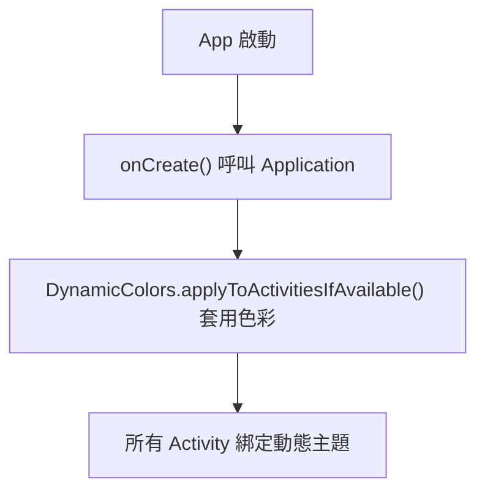
```mermaid
flowchart TD
    A["App 啟動"] --> B["onCreate() 呼叫 Application"]
    B --> C["DynamicColors.applyToActivitiesIfAvailable() 套用色彩"]
    C --> D["所有 Activity 綁定動態主題"]
```

### `MainActivity.java`
- 功能：主畫面輸入金額與備註、選擇類別、儲存記帳，並可進入歷史、設定與週期性付款。
- 主要 UI：`amountInput`, `noteInput`, `categoryGrid`, `saveButton`, `topAppBar`, `recurringFab`
- 主要流程：
  1. `loadCategories()` 從 SQLite 載入類別並補入「其他」。
  2. `saveRecord()` 驗證輸入，取得類別後進入定位流程。
  3. `performDatabaseSave()` 背景寫入 SQLite，呼叫雲端同步。
  4. 若預設類別為自動，`saveWithPlaceholderThenAutoSelect()` 先存「其他」再啟動 `AutoCategoryService`。
  5. `checkPermission()` 申請定位權限；`prefetchLocation()` 預先抓取座標。
  6. `onUserLeaveHint()`/返回鍵觸發 `StatusChipService` 顯示離開時總額。
- 資料來源：`DatabaseHelper`、`SharedPreferences`、`FusedLocationProviderClient`
- 版面資源：`activity_main.xml`
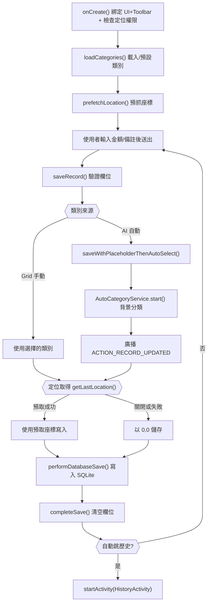
```mermaid
flowchart TD
    A["onCreate() 綁定 UI+Toolbar + 檢查定位權限"] --> B["loadCategories() 載入/預設類別"]
    B --> C["prefetchLocation() 預抓座標"]
    C --> D["使用者輸入金額/備註後送出"]
    D --> H["saveRecord() 驗證欄位"]
    H --> E{{"類別來源"}}
    E -->|"Grid 手動"| F["使用選擇的類別"]
    F --> I{{"定位取得 getLastLocation()"}}
    E -->|"AI 自動"| G["saveWithPlaceholderThenAutoSelect()" ]
    I -->|"預取成功"| J["使用預取座標寫入"]
    I -->|"關閉或失敗"| L["以 0,0 儲存"]
    J --> M["performDatabaseSave() 寫入 SQLite"]
    L --> M
    M --> N["completeSave() 清空欄位"]
    N --> O{{"自動跳歷史?"}}
    O -->|"是"| P["startActivity(HistoryActivity)"]
    O -->|"否"| D
    G --> R["AutoCategoryService.start() 背景分類"]
    R --> Z["廣播 ACTION_RECORD_UPDATED"]
    Z --> I
```

### `HistoryActivity.java`
- 功能：顯示歷史清單與總額、提供 CSV 匯入/匯出/分享、接收自動分類更新廣播。
- 主要 UI：`historyListView`, `totalAmountText`, `cardTotal`, `historyToolbar`, `fabAdd`
- 主要流程：
  1. `loadRecords()` 背景讀取 SQLite，計算總額並更新 ListView。
  2. `recordUpdatedReceiver` 接收廣播後重新載入並動畫提示。
  3. `exportToFile()`/`shareByCsv()` 產出 CSV；`importFromCsv()` 可 Append/Overwrite。
- 資料來源：`DatabaseHelper`、`CsvHelper`
- 版面資源：`activity_history.xml`
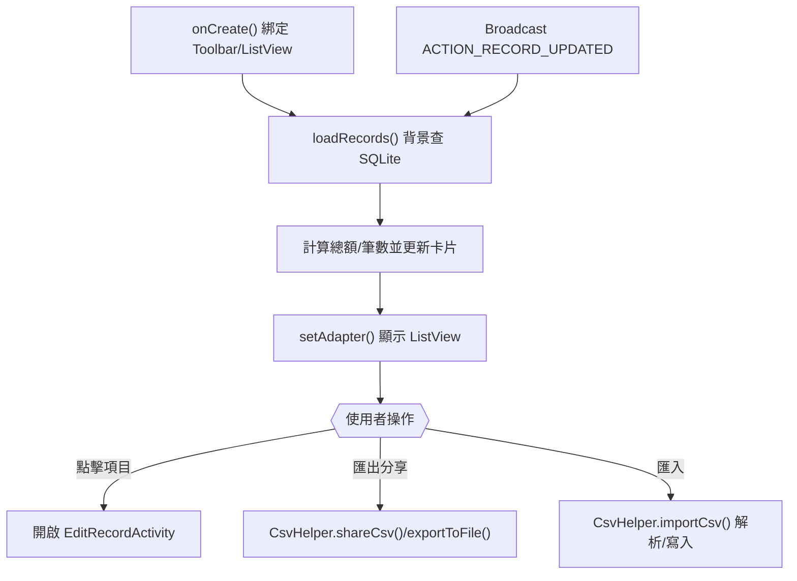
```mermaid
flowchart TD
    A["onCreate() 綁定 Toolbar/ListView"] --> B["loadRecords() 背景查 SQLite"]
    B --> C["計算總額/筆數並更新卡片"]
    C --> D["setAdapter() 顯示 ListView"]
    D --> E{{"使用者操作"}}
    E -->|"點擊項目"| F["開啟 EditRecordActivity"]
    E -->|"匯出分享"| G["CsvHelper.shareCsv()/exportToFile()"]
    E -->|"匯入"| H["CsvHelper.importCsv() 解析/寫入"]
    I["Broadcast ACTION_RECORD_UPDATED"] --> B
```

### `EditRecordActivity.java`
- 功能：編輯或刪除單筆紀錄，支援時間調整、地圖預覽、跳轉全螢幕地圖。
- 主要 UI：`editAmountInput`, `editNoteInput`, `editTimeInput`, `editCategoryGrid`, `mapContainer`
- 主要流程：
  1. 由 Intent 取得紀錄資料並填入欄位。
  2. `showDateTimePicker()` 修改時間。
  3. 若有座標則顯示地圖與地址；點擊地圖卡片開啟 `FullMapActivity`。
  4. `handlePrimaryAction()` 判斷是否變更，更新或刪除。
- 資料來源：`DatabaseHelper`、`Geocoder`
- 版面資源：`activity_edit_record.xml`
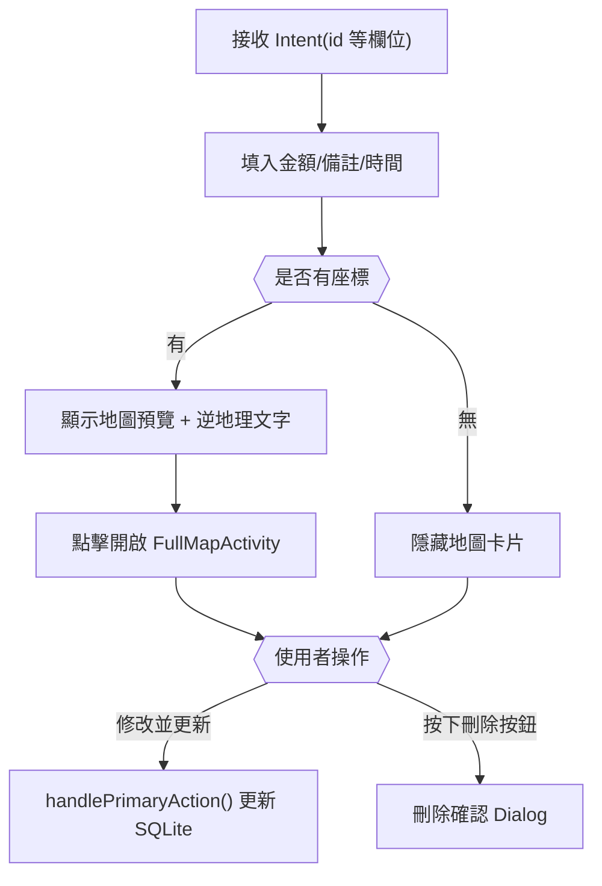
```mermaid
flowchart TD
    A["接收 Intent(id 等欄位)"] --> B["填入金額/備註/時間"]
    B --> C{{"是否有座標"}}
    C -->|"有"| D["顯示地圖預覽 + 逆地理文字"]
    D --> E["點擊開啟 FullMapActivity"]
    C -->|"無"| F["隱藏地圖卡片"]
    E --> G{{"使用者操作"}}
    F --> G
    G -->|"修改並更新"| H["handlePrimaryAction() 更新 SQLite"]
    G -->|"按下刪除按鈕"| I["刪除確認 Dialog"]
```

### `ChartActivity.java`
- 功能：依類別彙總金額並輸出總額、筆數、平均與條狀圖，給使用者快速掌握支出結構。
- 主要 UI：`totalAmountText`、`totalCountText`、`averageAmountText`、`chartContainer`（動態加入 `item_chart_bar.xml`）。
- 主要流程：
  1. `loadChart()` 以背景執行緒呼叫 `DatabaseHelper.readRecordList()`，將 `Record` 依類別聚合並計算總額與平均。
  2. 聚合結果排序後交給 `renderChart()`，依最大值計算百分比並產生每個條狀項目。
  3. 點擊 Toolbar 返回或旋轉螢幕時會重新渲染，確保資料與 UI 同步。
- 資料來源：`DatabaseHelper` 的記帳表查詢。
- 版面資源：`activity_chart.xml`、`item_chart_bar.xml`
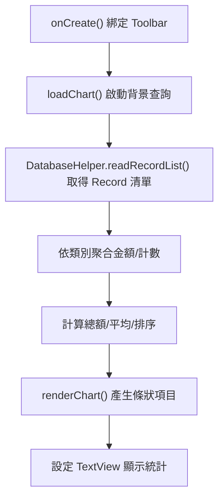
```mermaid
flowchart TD
    A["onCreate() 綁定 Toolbar"] --> B["loadChart() 啟動背景查詢"]
    B --> C["DatabaseHelper.readRecordList() 取得 Record 清單"]
    C --> D["依類別聚合金額/計數"]
    D --> E["計算總額/平均/排序"]
    E --> F["renderChart() 產生條狀項目"]
    F --> G["設定 TextView 顯示統計"]
```

### `FullMapActivity.java`
- 功能：放大顯示單筆紀錄的位置，允許修改「地點備註」並寫回資料庫，補充主畫面地圖卡的詳細資訊。
- 主要 UI：`SupportMapFragment`、`locationNameView`、`locationCard`、`editLocationName()` 的 Dialog。
- 主要流程：
  1. 從 Intent 讀取經緯度與現有地點名稱，初始化 GoogleMap 並置入 Marker。
  2. `onMapReady()` 以 `CameraUpdateFactory` 聚焦並更新卡片文字；點擊卡片呼叫 `showEditLocationDialog()`。
  3. 使用者輸入新的地點備註後呼叫 `DatabaseHelper.updateRecordLocationName()` 寫回並重新顯示。
- 資料來源：`DatabaseHelper`（更新記錄欄位）。
- 版面資源：`activity_full_map.xml`
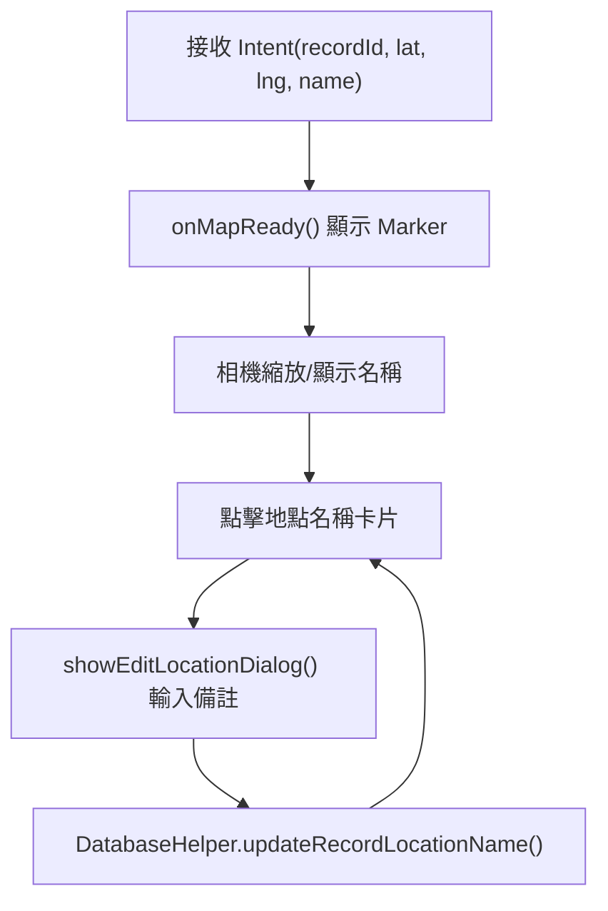
```mermaid
flowchart TD
    A["接收 Intent(recordId, lat, lng, name)"] --> B["onMapReady() 顯示 Marker"]
    B --> C["相機縮放/顯示名稱"]
    C --> D["點擊地點名稱卡片"]
    D --> E["showEditLocationDialog() 輸入備註"]
    E --> F["DatabaseHelper.updateRecordLocationName()"]
    F --> D
```

### `SettingsActivity.java`
- 功能：集中管理定位、主題、自動分類 API、Google 登入、雲端備份/還原、週期性通知等偏好設定。
- 主要 UI：多組 `MaterialSwitch`、API Key/URL `TextInputEditText`、雲端備份/還原按鈕、偵錯資料插入按鈕。
- 主要流程：
  1. 啟動時從 `SharedPreferences` 載入各項設定並綁定 UI；切換定位、自動跳歷史、預設類別、自動分類 API 時立即寫回偏好。
  2. `handleGoogleSignIn()` 透過 `GoogleSignInClient` 取得 IdToken，`FirebaseAuth` 登入成功後啟用 CloudBackup，並可手動 `syncNow()` 或 `restoreFromCloud()`。
  3. 週期性付款的提醒開關會呼叫 `RecurringPaymentWorker.schedule()` 與 `RecurringPaymentAlarmReceiver.scheduleAllMinute()`，確保排程更新。
- 資料來源：`SharedPreferences`、`FirebaseAuth`、`GoogleSignInClient`、`CloudBackupManager`。
- 版面資源：`activity_settings.xml`
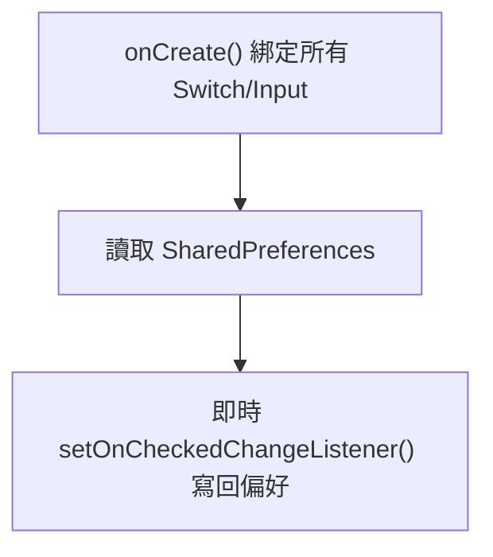
```mermaid
flowchart TD
    A["onCreate() 綁定所有 Switch/Input"] --> B["讀取 SharedPreferences" ]
    B --> C["即時 setOnCheckedChangeListener() 寫回偏好"]
```

### `StatusChipService.java`
- 功能：在使用者離開 App 時，以 Overlay 顯示最近總額 5 秒鐘，提供快速確認。
- 主要流程：
  1. 由 `MainActivity.onUserLeaveHint()` 或返回鍵觸發，先檢查 `Settings.canDrawOverlays()` 權限。
  2. 背景執行 `DatabaseHelper.getTotalAmount()` 取得總額，組合顯示文字與關閉計時器。
  3. `WindowManager.addView()` 顯示 `activity_status_chip.xml`，5 秒後自動 `removeView()`。 
- 資料來源：`DatabaseHelper`。
- 版面資源：`activity_status_chip.xml`
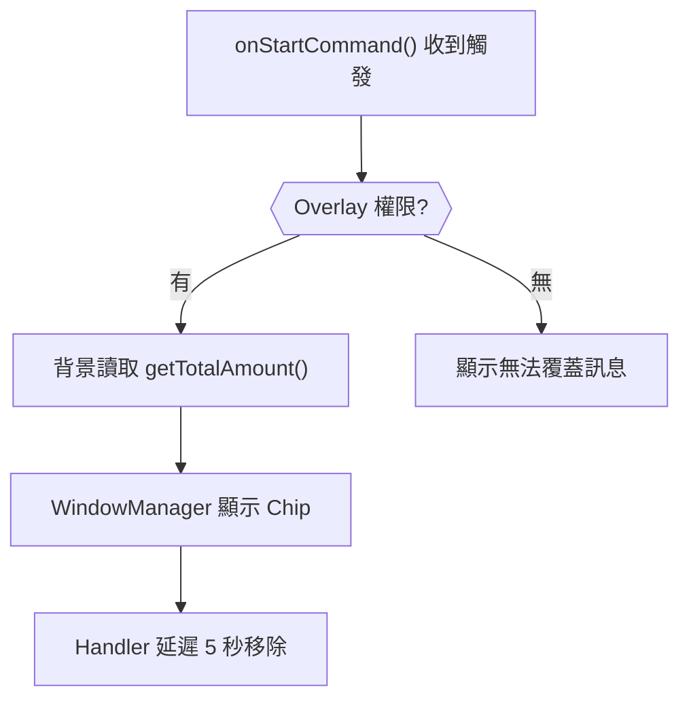
```mermaid
flowchart TD
    A["onStartCommand() 收到觸發"] --> B{{"Overlay 權限?"}}
    B -->|"有"| C["背景讀取 getTotalAmount()"]
    B -->|"無"| D["顯示無法覆蓋訊息"]
    C --> E["WindowManager 顯示 Chip"]
    E --> F["Handler 延遲 5 秒移除"]
```

### `AutoCategoryService.java`
- 功能：在背景呼叫 AI API 決定自動分類，寫回資料庫、觸發雲端備份並廣播更新，維持前景 UI 即時性。
- 主要流程：
  1. 由 `MainActivity.saveWithPlaceholderThenAutoSelect()` 帶入紀錄 ID、金額、備註與候選類別；服務啟動後讀取 `SharedPreferences` 取 API Key/URL。
  2. `AutoCategoryClient.requestAutoCategory()` 組合模型、提示詞與候選列表發出 HTTP 請求，若主模型無效自動切換備援模型再試。
  3. 取得結果後 `DatabaseHelper.updateRecordCategory()` 寫回，`CloudBackupManager.requestSyncIfEnabled()` 同步 Firestore，並 `sendBroadcast(ACTION_RECORD_UPDATED)` 提醒 UI 重載。
- 資料來源：`AutoCategoryClient`、`DatabaseHelper`、`CloudBackupManager`。
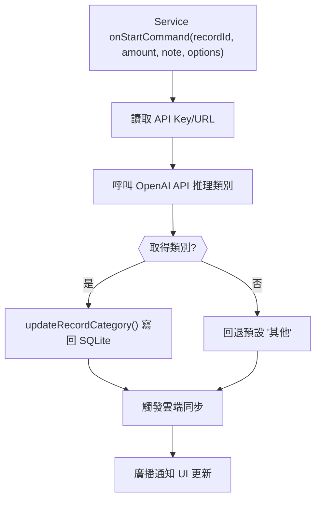
```mermaid
flowchart TD
    A["Service onStartCommand(recordId, amount, note, options)"] --> B["讀取 API Key/URL"]
    B --> C["呼叫 OpenAI API 推理類別"]
    C --> D{{"取得類別?"}}
    D -->|"是"| E["updateRecordCategory() 寫回 SQLite"]
    D -->|"否"| F["回退預設 '其他'"]
    E --> G["觸發雲端同步"]
    F --> G
    G --> H["廣播通知 UI 更新"]
```

### `AutoCategoryClient.java`
- 功能：封裝 OpenAI 或 GitHub Models 的 HTTP 呼叫、模型 fallback 與 JSON 解析，確保自動分類穩定取得結果。
- 主要流程：
  1. `normalizeApiUrl()`/`normalizeToken()` 將使用者輸入的 URL 與 Token 標準化，避免重複的 slash 或 header 格式錯誤。
  2. `requestOnce()` 建立 prompt/候選列表後送出 POST，依 HTTP 代碼或 response 內容判斷模型有效性。
  3. 若模型無效則 `getFallbackModel()` 選擇備援名稱並重試；成功時 `parseCategoryFromResponse()` 解析訊息內容回傳單一分類字串。
- 資料來源：外部 AI API（OpenAI/GitHub Models）。
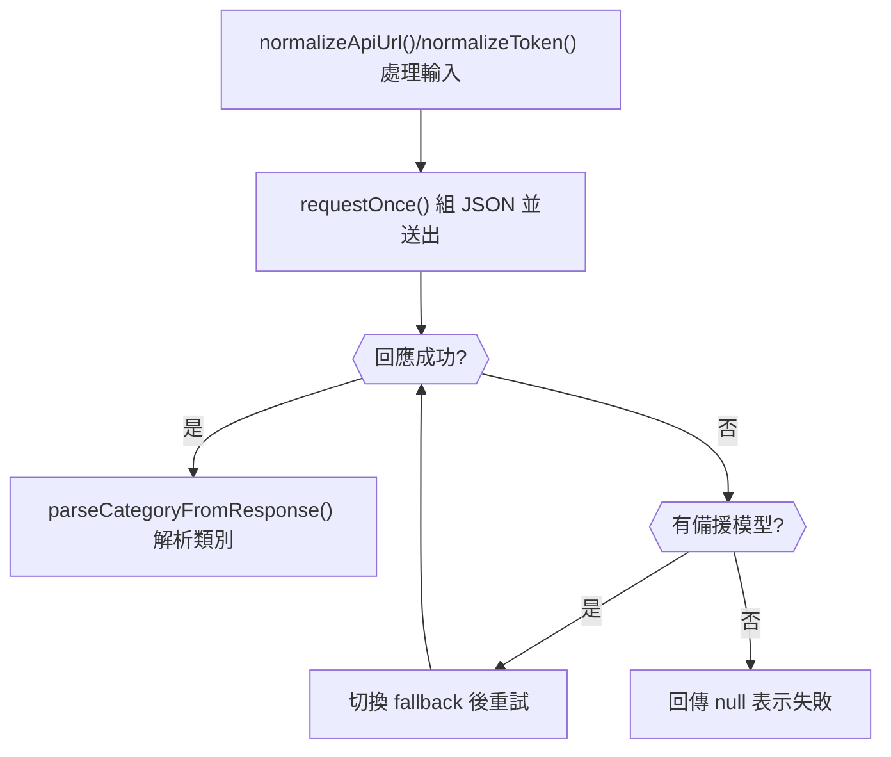
```mermaid
flowchart TD
    A["normalizeApiUrl()/normalizeToken() 處理輸入"] --> B["requestOnce() 組 JSON 並送出"]
    B --> C{{"回應成功?"}}
    C -->|"是"| D["parseCategoryFromResponse() 解析類別"]
    C -->|"否"| E{{"有備援模型?"}}
    E -->|"是"| F["切換 fallback 後重試"]
    F --> C
    E -->|"否"| G["回傳 null 表示失敗"]
```

### `ManageCategoriesActivity.java`
- 功能：提供類別的新增、刪除與拖曳排序，並即時寫回 SQLite 以便主畫面/自動分類使用一致的類別列表。
- 主要 UI：`RecyclerView` 類別清單、輸入框、`addCategoryButton`、`ItemTouchHelper` 拖曳手把。
- 主要流程：
  1. `loadCategories()` 於背景讀取類別並以 `CategoryAdapter` 套用顏色樣式後顯示。
  2. `ItemTouchHelper` 的 `onMove()` 交換列表位置並 `clearView()` 內迭代呼叫 `updateCategoryOrder()` 寫回排序欄位。
  3. 長按刪除圖示時彈出確認 Dialog，確認後 `deleteCategory()` 並重新整理列表。
- 資料來源：`DatabaseHelper`。
- 版面資源：`activity_manage_categories.xml`
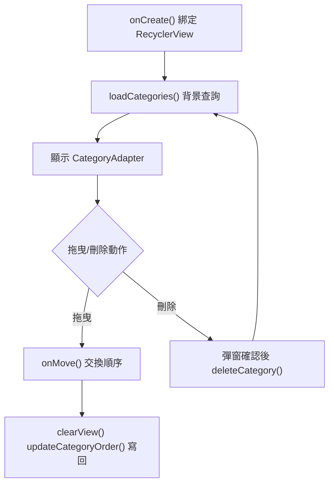
```mermaid
flowchart TD
    A["onCreate() 綁定 RecyclerView"] --> B["loadCategories() 背景查詢"]
    B --> C["顯示 CategoryAdapter"]
    C --> D{"拖曳/刪除動作"}
    D -->|"拖曳"| E["onMove() 交換順序"]
    E --> F["clearView() updateCategoryOrder() 寫回"]
    D -->|"刪除"| G["彈窗確認後 deleteCategory()"]
    G --> B
```

### `DatabaseHelper.java`
- 功能：集中管理 SQLite（records、categories、recurring_payments）建表與 CRUD；供主畫面、歷史、圖表、週期性付款與雲端備份共用。
- 主要流程：
  1. `onCreate()` 建立三張表並呼叫 `seedCategories()` 插入預設類別；`onUpgrade()` 覆蓋重建處理版本升級。
  2. 提供 `insertRecordAndReturnId()`、`updateRecord()`、`deleteRecord()` 等方法，並支援批次匯入與排序更新。
  3. `getTotalAmount()` 為離開提示、`readRecordList()` 為圖表與歷史頁提供資料，`readRecurringPayments()`/`updateRecurringPayment()` 支援排程。
- 資料來源：內建 SQLite。
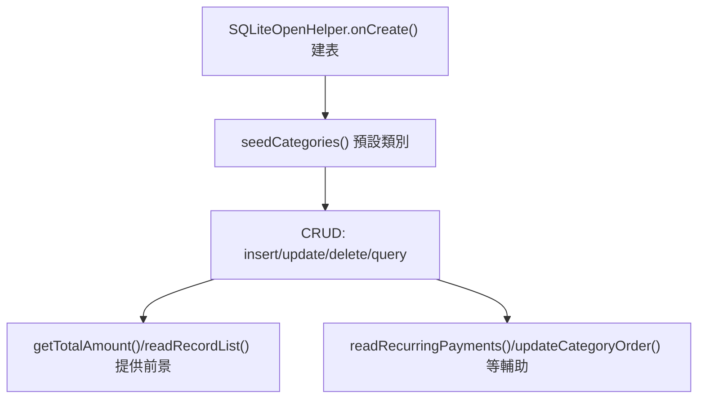
```mermaid
flowchart TD
    A["SQLiteOpenHelper.onCreate() 建表"] --> B["seedCategories() 預設類別"]
    B --> C["CRUD: insert/update/delete/query"]
    C --> D["getTotalAmount()/readRecordList() 提供前景"]
    C --> E["readRecurringPayments()/updateCategoryOrder() 等輔助"]
```

### `CsvHelper.java`
- 功能：處理 CSV 匯出/匯入、分享與座標轉換，確保跨裝置資料可攜。
- 主要流程：
  1. `generateCsvContent(records)` 把 `Record` 清單轉成含地點文字與經緯度的 CSV 字串。
  2. `writeCsvToUri()`/`shareCsv()` 透過 `FileProvider` 暴露 content URI 供分享或儲存。
  3. `importCsv()` 逐列解析，先用 `Geocoder` 反查座標，再回傳 `Record` 清單給呼叫端寫入 SQLite。
- 資料來源：`Geocoder`、`FileProvider`、`DatabaseHelper`（寫入端）。
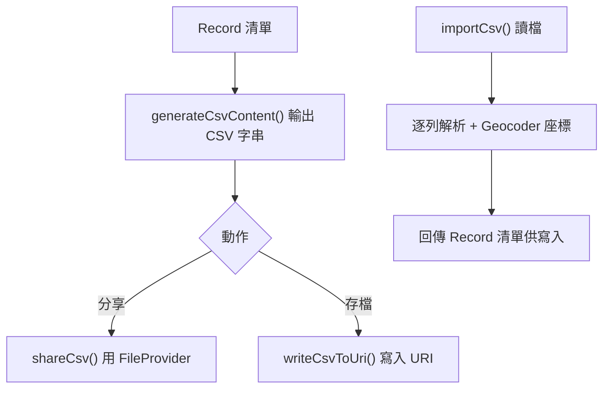
```mermaid
flowchart TD
    A["Record 清單"] --> B["generateCsvContent() 輸出 CSV 字串"]
    B --> C{"動作"}
    C -->|"分享"| D["shareCsv() 用 FileProvider"]
    C -->|"存檔"| E["writeCsvToUri() 寫入 URI"]
    F["importCsv() 讀檔"] --> G["逐列解析 + Geocoder 座標"]
    G --> H["回傳 Record 清單供寫入"]
```

### `CloudBackupIndicator.java` + `CloudBackupManager.java`
- 功能：`CloudBackupIndicator` 負責 UI 提示與狀態呈現；`CloudBackupManager` 負責雲端同步/還原/驗證，兩者透過偏好與狀態更新形成完整雲端備份流程。
- 主要流程：
  1. `SettingsActivity` 切換雲端備份或登入狀態後，`CloudBackupIndicator.register()` 監聽偏好變化，先行更新 icon 與提示。
  2. `CloudBackupManager.syncNow()` 讀取本地 SQLite（records/categories/recurring_payments）組成 payload，上傳到 `users/{uid}/backups/latest`，並排程 `scheduleVerify()` 做筆數驗證。
  3. 驗證成功/失敗時更新 `CloudBackupManager.Status`，`CloudBackupIndicator` 再次刷新雲朵 icon 與 Snackbar，讓使用者知道同步結果。
  4. 使用者手動還原時 `restoreFromCloud()` 下載最新備份，背景寫回 SQLite，並重新排程 WorkManager/Alarm，確保週期性付款不漏。
- 資料來源：`SharedPreferences`、`FirebaseAuth`、`FirebaseFirestore`、`DatabaseHelper`、`CloudBackupManager.Status`。
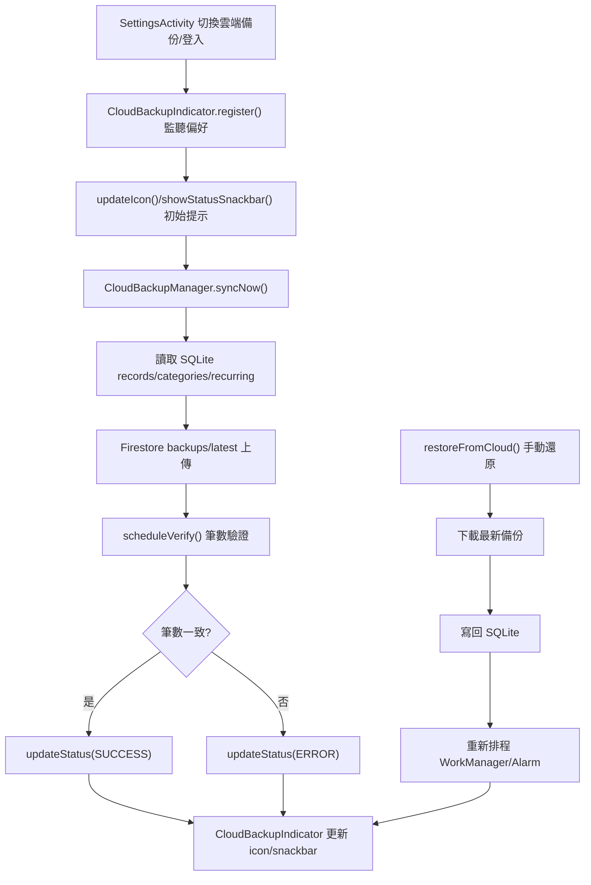
```mermaid
flowchart TD
    A["SettingsActivity 切換雲端備份/登入"] --> B["CloudBackupIndicator.register() 監聽偏好"]
    B --> C["updateIcon()/showStatusSnackbar() 初始提示"]
    C --> D["CloudBackupManager.syncNow()"]
    D --> E["讀取 SQLite records/categories/recurring"]
    E --> F["Firestore backups/latest 上傳"]
    F --> G["scheduleVerify() 筆數驗證"]
    G --> H{"筆數一致?"}
    H -->|"是"| I["updateStatus(SUCCESS)"]
    H -->|"否"| J["updateStatus(ERROR)"]
    I --> K["CloudBackupIndicator 更新 icon/snackbar"]
    J --> K
    L["restoreFromCloud() 手動還原"] --> M["下載最新備份"]
    M --> N["寫回 SQLite"]
    N --> O["重新排程 WorkManager/Alarm"]
    O --> K
```

### `RecurringPayment.java` + `RecurringPaymentActivity.java` + `RecurringPaymentAdapter.java`
- 功能：`RecurringPayment` 定義週期性付款資料；`RecurringPaymentActivity` 讀取並管理清單；`RecurringPaymentAdapter` 把模型轉成可讀的頻率文案與列表項目。
- 主要流程：
  1. `RecurringPaymentActivity.onCreate()` 綁定 ListView/FAB，呼叫 `loadRecurringList()` 於背景從 SQLite 取出 `RecurringPayment` 清單。
  2. `RecurringPaymentAdapter.getView()` 依 `frequency/weekday/day/hour/minute` 組合標題與描述（如「每週三 12:00」「每分鐘」），並設定點擊回呼。
  3. 使用者點擊項目時開啟 `RecurringPaymentEditActivity` 編輯；刪除全部時呼叫 `deleteAllRecurringPayments()`；`onPause()` 重新排程 Worker/Alarm。
- 資料來源：`DatabaseHelper`。
- 版面資源：`activity_recurring_payment.xml`
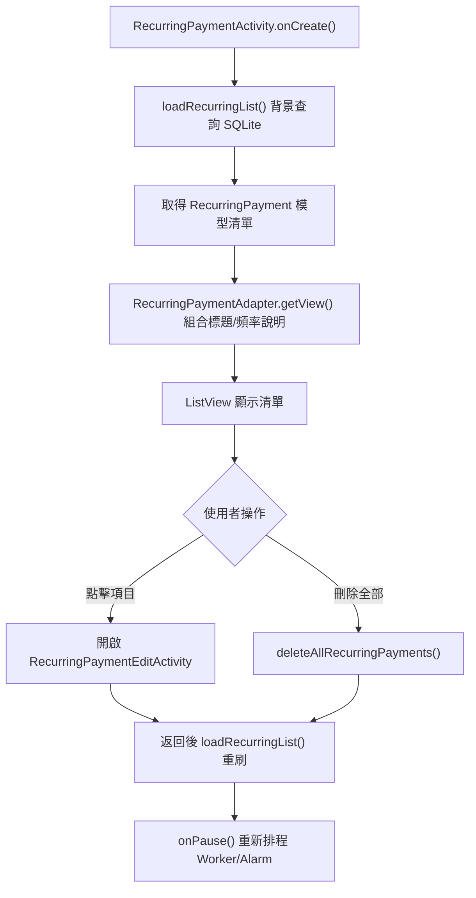
```mermaid
flowchart TD
    A["RecurringPaymentActivity.onCreate()"] --> B["loadRecurringList() 背景查詢 SQLite"]
    B --> C["取得 RecurringPayment 模型清單"]
    C --> D["RecurringPaymentAdapter.getView() 組合標題/頻率說明"]
    D --> E["ListView 顯示清單"]
    E --> F{"使用者操作"}
    F -->|"點擊項目"| G["開啟 RecurringPaymentEditActivity"]
    F -->|"刪除全部"| H["deleteAllRecurringPayments()"]
    G --> I["返回後 loadRecurringList() 重刷"]
    H --> I
    I --> J["onPause() 重新排程 Worker/Alarm"]
```

### `RecurringPaymentEditActivity.java`
- 功能：新增或編輯週期性付款，依不同頻率顯示對應的輸入欄位，並在儲存後自動排程背景任務。
- 主要流程：
  1. `setupFrequencyGroup()` 切換 `minute/week/day` 等輸入元件的可見度，確保表單正確。
  2. `save()` 驗證金額與頻率後呼叫 `DatabaseHelper.insertOrUpdateRecurringPayment()` 寫入，接著 `RecurringPaymentWorker.schedule()` 與 `RecurringPaymentAlarmReceiver.scheduleAllMinute()` 重新排程。
  3. `handlePrimaryAction()` 判斷是否為編輯模式，決定更新/刪除並回傳結果給列表頁。
- 資料來源：`DatabaseHelper`。
- 版面資源：`activity_recurring_payment_edit.xml`
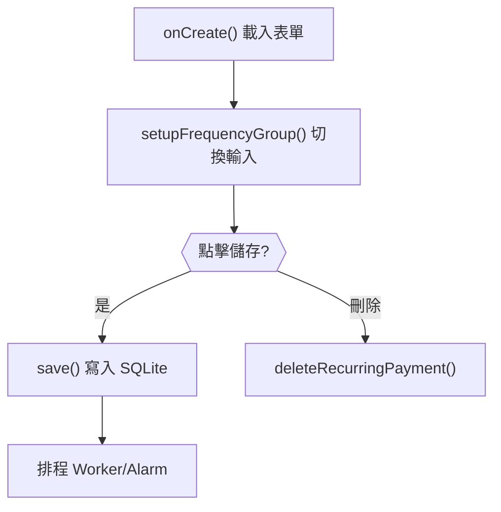
```mermaid
flowchart TD
    A["onCreate() 載入表單"] --> B["setupFrequencyGroup() 切換輸入"]
    B --> C{{"點擊儲存?"}}
    C -->|"是"| D["save() 寫入 SQLite"]
    D --> E["排程 Worker/Alarm"]
    C -->|"刪除"| F["deleteRecurringPayment()"]
```

### `RecurringPaymentWorker.java`
- 功能：每日由 WorkManager 觸發，檢查非 minute 類型的週期性付款是否到期，並自動插入紀錄、發通知與雲端同步。
- 主要流程：
  1. `doWork()` 讀取所有 recurring 資料，對 daily/weekly/monthly 逐筆判斷 `shouldInsertToday()`。
  2. 若到期則 `insertRecordAndReturnId()` 寫入記帳、更新 `lastRunAt`，並透過 `NotificationHelper` 通知使用者。
  3. 最後呼叫 `CloudBackupManager.requestSyncIfEnabled()` 同步備份。
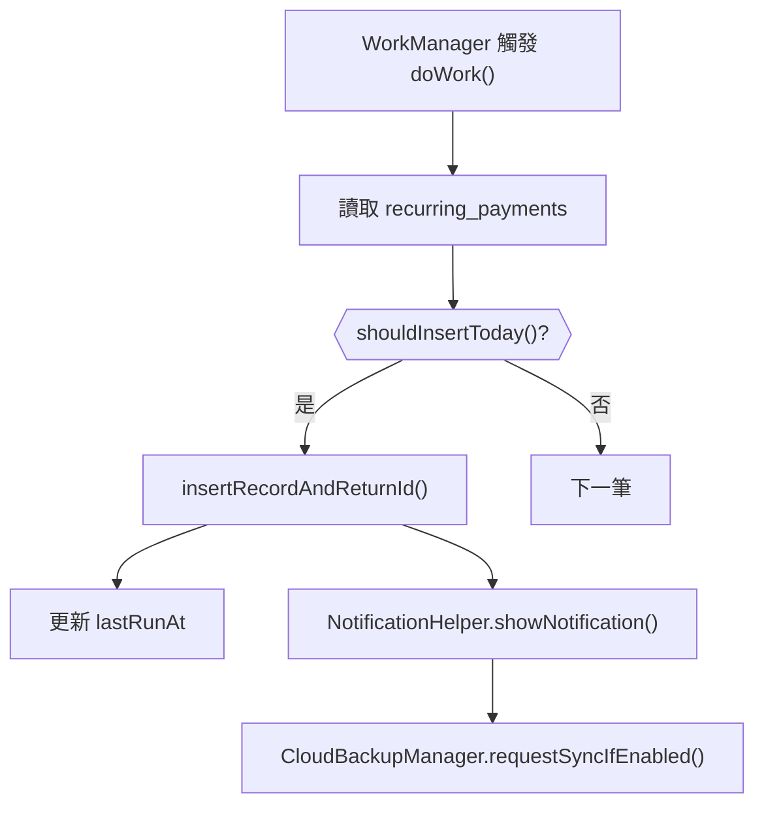
```mermaid
flowchart TD
    A["WorkManager 觸發 doWork()"] --> B["讀取 recurring_payments"]
    B --> C{{"shouldInsertToday()?"}}
    C -->|"是"| D["insertRecordAndReturnId()"]
    D --> E["更新 lastRunAt"]
    D --> F["NotificationHelper.showNotification()"]
    F --> G["CloudBackupManager.requestSyncIfEnabled()"]; 
    C -->|"否"| H["下一筆"]
```

### `RecurringPaymentAlarmReceiver.java`
- 功能：偵錯用，負責 minute 頻率的 AlarmManager 觸發，精準到每分鐘寫入記帳並重新排程下一次。
- 主要流程：
  1. `scheduleAllMinute()` 於設定頁或開機時取得 minute 項目並為每筆排程 Alarm。
  2. `onReceive()` 取得對應 recurring，呼叫 `insertRecordAndReturnId()` 插入紀錄、`NotificationHelper` 通知，最後以 `scheduleNextMinute()` 為該筆排下一次。
  3. 執行後同樣會呼叫 `CloudBackupManager.requestSyncIfEnabled()`，維持雲端一致。
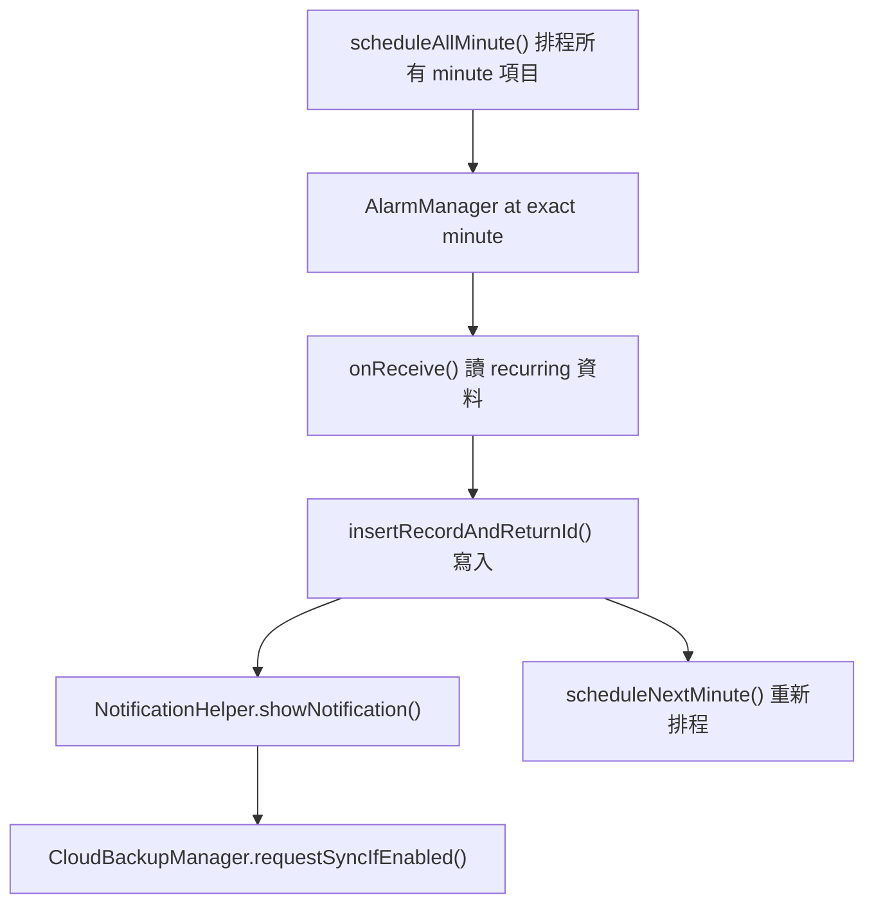
```mermaid
flowchart TD
    A["scheduleAllMinute() 排程所有 minute 項目"] --> B["AlarmManager at exact minute"]
    B --> C["onReceive() 讀 recurring 資料"]
    C --> D["insertRecordAndReturnId() 寫入"]
    D --> E["NotificationHelper.showNotification()"]
    E --> F["CloudBackupManager.requestSyncIfEnabled()"]
    D --> G["scheduleNextMinute() 重新排程"]
```

---

## 五、結果展示（5 分）

### 展示實際執行成果與畫面截圖

- 主畫面：輸入金額、備註，類別 Grid 選擇與儲存。
  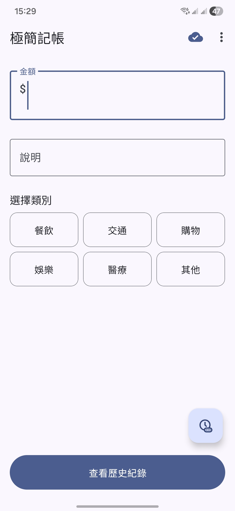
  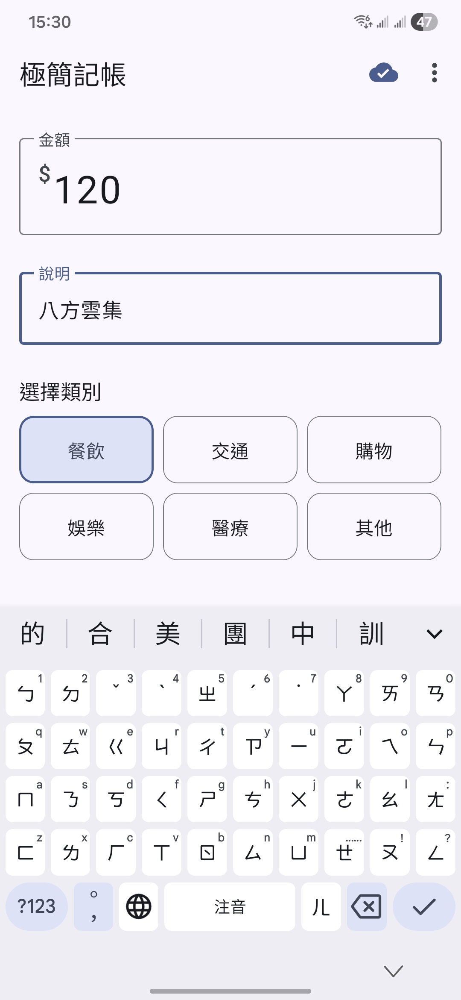

- 歷史清單：總額卡片、ListView 列表、CSV 匯出/匯入入口。
  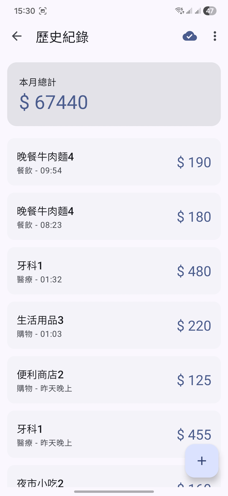

- 編輯紀錄：時間修改、類別切換、地圖預覽。
  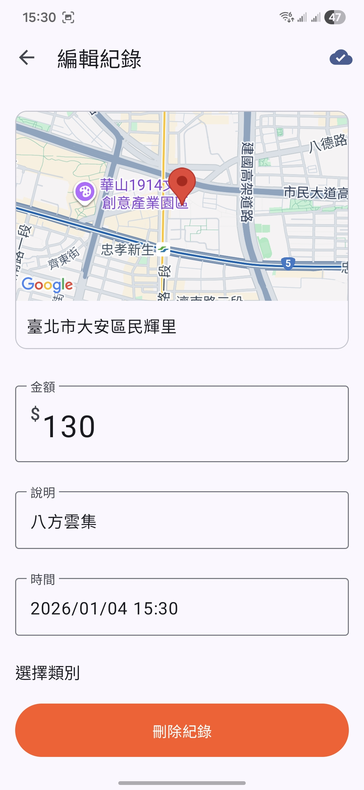
  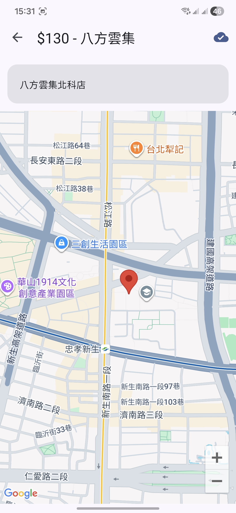

- 圖表統計：類別長條圖、總額/筆數/平均。
  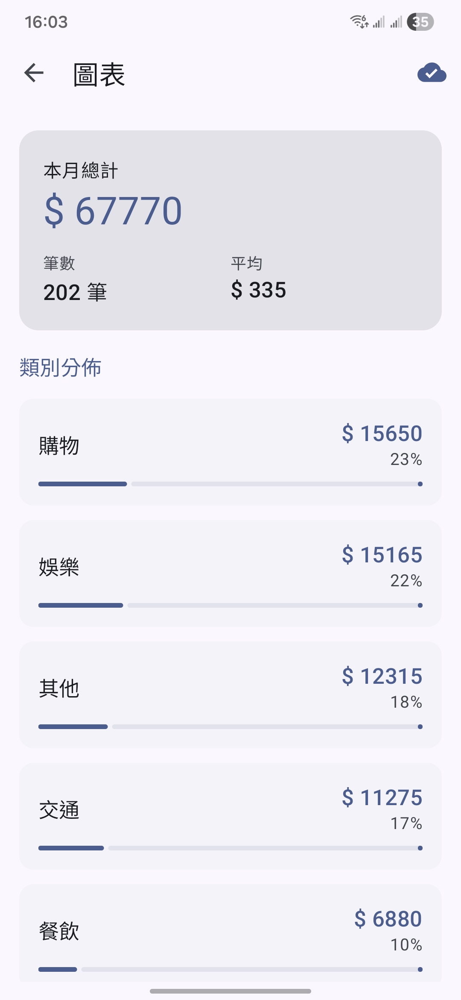

- 週期性付款：清單與編輯頁。
  
  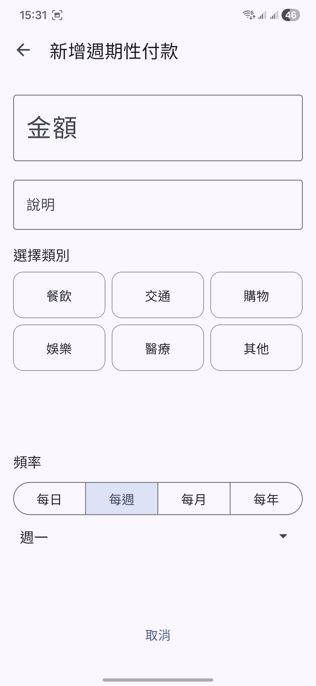

- 設定頁：雲端備份、Google 登入、API 設定。
  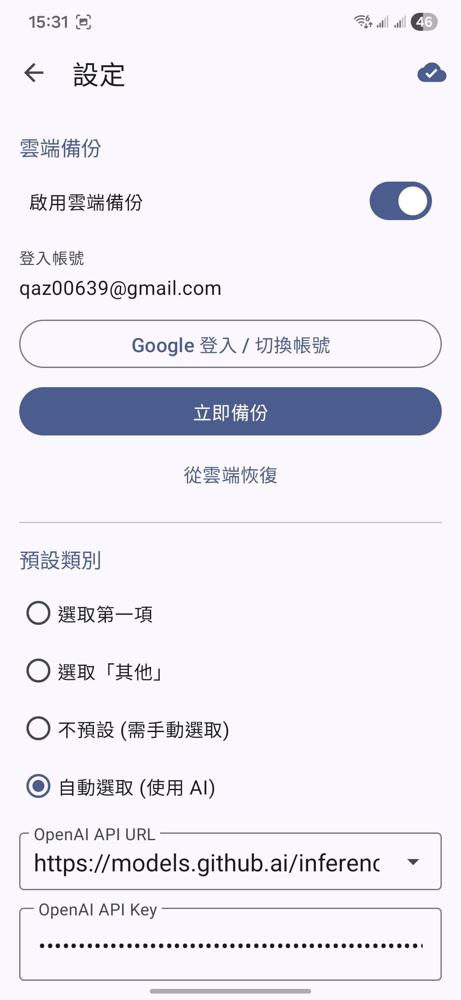
  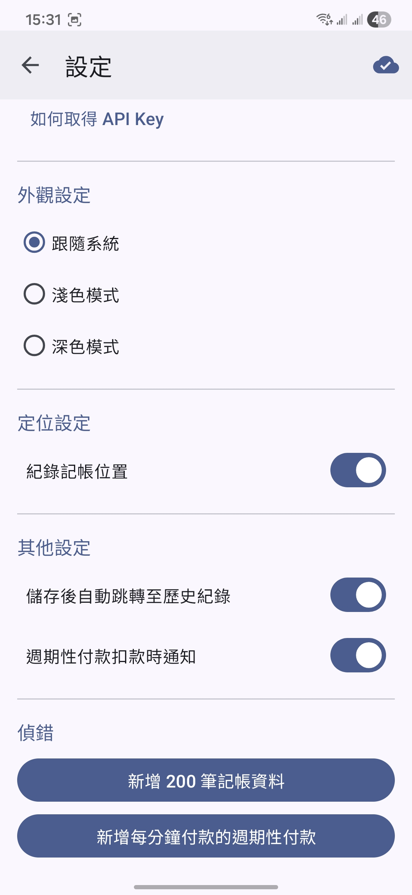

- 退出時狀態提示：Overlay 顯示累計金額。
  

Simplest Book Android 是一款主打「快速、極簡」的記帳 App，以最少步驟完成記錄，同時提供週期性付款、位置備註、統計圖表與雲端備份等功能。

### 功能特色

- **極速記帳**：輸入金額與備註、選類別即可完成儲存。
- **自動分類（選用）**：可先以「其他」存檔，背景由 AI 自動回填類別。
- **歷史與編輯**：查詢清單、編輯金額/備註/時間/地點備註。
- **統計圖表**：依類別彙總金額、筆數與平均。
- **週期性付款**：每日/每週/每月/每年與每分鐘排程通知。
- **定位支援**：可選擇記錄座標，並在地圖頁顯示與補充備註。
- **CSV 匯入匯出**：支援分享、匯出與匯入資料。
- **雲端備份**：Firestore 同步與還原，狀態圖示提示。
- **離開提示**：離開 App 顯示總額小視窗。

### 簡化整體架構

App 以 SQLite 為核心資料庫，搭配背景服務完成同步與自動化。

```
UI (Activities)
  - MainActivity：輸入、類別選擇、儲存
  - HistoryActivity：列表 + CSV 匯入/匯出
  - EditRecordActivity / FullMapActivity：編輯 + 地點備註
  - ChartActivity：統計彙整
  - SettingsActivity：偏好設定 + 雲端登入
  - RecurringPaymentActivity/Edit：週期性付款管理

Local Data
  - DatabaseHelper (SQLite)
  - Models：Record, Category, RecurringPayment
  - Adapters：CategoryAdapter, RecordAdapter, RecurringPaymentAdapter

Background + Services
  - AutoCategoryService + AutoCategoryClient（AI 自動分類）
  - RecurringPaymentWorker / RecurringPaymentAlarmReceiver
  - CloudBackupManager + CloudBackupIndicator
  - StatusChipService
```

### 主要流程（簡述）

1. **新增記帳**
   - MainActivity 驗證輸入 → 取得類別/座標 → 寫入 SQLite。
   - 若啟用自動分類，AutoCategoryService 背景更新類別。
   - 若啟用雲端備份，觸發同步。

2. **週期性付款**
   - RecurringPaymentActivity 管理項目並寫入 SQLite。
   - WorkManager 處理日/週/月/年；AlarmManager 處理每分鐘。

3. **雲端備份**
   - SettingsActivity 開啟備份並完成 Google 登入。
   - CloudBackupManager 上傳/驗證或從雲端還原資料。

---


## 六、使用課堂上所學技術說明

以下重新整理技術分類，補上使用位置、觸發流程與上下文說明，並引用實作程式碼片段呈現完整脈絡。

### （一）使用到的外部 API 技術（10 分）

- API 名稱：OpenAI API（亦支援 GitHub Models URL）
- 使用位置：AutoCategoryClient.java、AutoCategoryService.java
- 使用情境：使用者快速記帳且未手動選類別時，交由 AI 自動判斷分類。
- 觸發流程：主畫面預設類別設為自動時，`saveWithPlaceholderThenAutoSelect()` 先把紀錄以「其他」存入資料庫，再交給 `AutoCategoryService.start()` 進入背景呼叫 API；回傳後寫回類別並觸發雲端同步與廣播通知。
- 程式碼（服務啟動 + API 請求 + 寫回）：
```java
// MainActivity.java - 將資料交給背景分類
saveRecordWithCategory(amount, placeholder, note, recordId -> {
    AutoCategoryService.start(this, recordId, amount, note, new ArrayList<>(options));
});

// AutoCategoryService.java - 背景取得結果並寫回
String selected = AutoCategoryClient.requestAutoCategory(
        prefs, apiKey, apiUrl, amount, note, optionList);
dbHelper.updateRecordCategory(recordId, selected);
CloudBackupManager.requestSyncIfEnabled(getApplicationContext());
sendBroadcast(updateIntent);
```
- 說明：`AutoCategoryClient` 會根據 API URL/Token 組合請求、在模型不可用時嘗試備援模型，再將解析的類別更新 SQLite，確保前景 UI 透過廣播即時刷新分類結果。

---

### （二）課堂技術一：Broadcast 發送與接收

- 使用位置：AutoCategoryService.java、HistoryActivity.java
- 使用情境：背景分類完成後即時刷新歷史清單，避免手動重整。
- 觸發流程：背景分類完成後送廣播，歷史頁收到後重讀資料。
- 程式碼（發送 + 接收 + 重新載入）：
```java
// AutoCategoryService.java - 寫回後廣播給前景頁面
Intent updateIntent = new Intent(ACTION_RECORD_UPDATED);
updateIntent.putExtra("extra_record_id", recordId);
updateIntent.putExtra("extra_category", selected);
sendBroadcast(updateIntent);

// HistoryActivity.java - 註冊並依 recordId 重載資料
IntentFilter filter = new IntentFilter(AutoCategoryService.ACTION_RECORD_UPDATED);
ContextCompat.registerReceiver(this, recordUpdatedReceiver, filter, ContextCompat.RECEIVER_NOT_EXPORTED);

private final BroadcastReceiver recordUpdatedReceiver = new BroadcastReceiver() {
    @Override
    public void onReceive(Context context, Intent intent) {
        String recordId = intent != null ? intent.getStringExtra("extra_record_id") : null;
        String category = intent != null ? intent.getStringExtra("extra_category") : null;
        loadRecords(recordId, category);
    }
};
```
- 說明：廣播攜帶紀錄 ID 與新類別，歷史頁依參數決定動畫與提示訊息，避免輪詢資料庫並能精準刷新單筆項目。

---

### （三）課堂技術二：SQLiteOpenHelper

- 使用位置：DatabaseHelper.java（記帳/類別/週期性三張表）
- 使用情境：在無網路環境也能寫入與查詢記帳資料。
- 觸發流程：存檔、編輯、刪除、匯入皆呼叫 CRUD。
- 程式碼（建表 + 寫入 + 取總額）：
```java
// DatabaseHelper.java - onCreate() 建立三張表並塞預設類別
db.execSQL(TABLE_RECORDS_CREATE);
db.execSQL(TABLE_CATEGORIES_CREATE);
db.execSQL(TABLE_RECURRING_CREATE);
seedCategories(db);

// MainActivity.java - performDatabaseSave() 背景執行寫入
String recordId = dbHelper.insertRecordAndReturnId(
        amount, category, note, "", System.currentTimeMillis(), lat, lon);

// DatabaseHelper.java - getTotalAmount() 給離開提示使用
public int getTotalAmount() { ... }
```
- 說明：SQLiteOpenHelper 封裝表結構與 CRUD，主畫面寫入與匯入 CSV 都共用同一個 helper，離線也能快速查詢並提供離開時的總額提示。

---

### （四）課堂技術三：ListView 與 GridView

- 使用位置：MainActivity.java（GridView）、HistoryActivity.java（ListView）
- 使用情境：主畫面快速選類別，歷史清單點擊即可進入編輯。
- 觸發流程：載入資料後綁定 Adapter，點擊項目觸發行為。
- 程式碼：
```java
// MainActivity.java - 類別選擇 Grid
categoryAdapter = new CategoryAdapter(this, categories);
categoryGrid.setAdapter(categoryAdapter);
categoryGrid.setOnItemClickListener((parent, view, position, id) -> {
    String selectedName = categories.get(position).getName();
    categoryAdapter.setSelectedCategory(selectedName);
});

// HistoryActivity.java - 歷史紀錄 ListView
historyListView.setAdapter(adapter);
historyListView.setOnItemClickListener((parent, view, position, id) -> {
    Record selectedRecord = recordList.get(position);
    Intent intent = new Intent(this, EditRecordActivity.class);
    intent.putExtra("id", selectedRecord.getId());
    ...
    startActivity(intent);
});
```
- 說明：GridView 以顏色框線呈現選取狀態，ListView 則讓使用者點擊進入編輯或匯出匯入，維持簡潔但可快速操作的 UI 流程。

---

### （五）課堂技術四：Google Map 與定位

- 使用位置：MainActivity.java（定位）、FullMapActivity.java（地圖）
- 使用情境：記帳時記錄消費位置，事後於地圖頁檢視與補充備註。
- 觸發流程：存檔時取得座標；編輯頁/地圖頁顯示 Marker。
- 程式碼：
```java
// MainActivity.java - 預抓或即時取得位置並寫入
fusedLocationClient.getCurrentLocation(Priority.PRIORITY_HIGH_ACCURACY, null)
        .addOnSuccessListener(location -> {
            if (location != null) {
                preFetchedLat = location.getLatitude();
                preFetchedLon = location.getLongitude();
            }
        });
fusedLocationClient.getLastLocation().addOnSuccessListener(location -> {
    double lat = 0.0, lon = 0.0;
    if (location != null) { lat = location.getLatitude(); lon = location.getLongitude(); }
    performDatabaseSave(amount, category, note, lat, lon, callback);
});

// FullMapActivity.java - 以座標顯示地圖並允許編輯備註
googleMap.addMarker(new MarkerOptions().position(location).title("位置"));
locationNameView.setOnClickListener(v -> showEditLocationDialog());
```
- 說明：定位流程同時支援預抓與即時 fallback，確保低延遲寫入；地圖頁再以 Marker 與地點備註呈現實際位置。

---

### （六）課堂技術五：Service（背景任務）

- 使用位置：AutoCategoryService.java、StatusChipService.java
- 使用情境：自動分類與離開提示在背景執行，避免阻塞前景。
- 觸發流程：存檔後自動分類、離開 App 顯示總額。
- 程式碼：
```java
// AutoCategoryService.java - Executor 背景呼叫 API 與資料庫
executor.execute(() -> {
    String selected = AutoCategoryClient.requestAutoCategory(...);
    dbHelper.updateRecordCategory(recordId, selected);
    CloudBackupManager.requestSyncIfEnabled(getApplicationContext());
    sendBroadcast(updateIntent);
    stopSelf(startId);
});

// StatusChipService.java - 背景查詢總額後顯示 Overlay
new Thread(() -> {
    int total = dbHelper.getTotalAmount();
    handler.post(() -> showOverlay(total));
}).start();
```
- 說明：將網路請求與資料庫操作放入背景執行緒或服務，避免主執行緒卡住；離開 App 仍能顯示總額提示，加強體驗。

---

### （八）課堂技術七：Toast / Dialog

- 使用位置：MainActivity.java、HistoryActivity.java、EditRecordActivity.java
- 使用情境：輸入驗證即時提示，刪除或匯入等動作需確認。
- 觸發流程：輸入驗證、刪除確認、匯入結果提示。
- 程式碼：
```java
// MainActivity.java - 未填金額立即提示
if (amountStr.isEmpty()) {
    Toast.makeText(this, "請輸入金額", Toast.LENGTH_SHORT).show();
    return;
}

// HistoryActivity.java - 匯入/匯出結果提示與選擇
new MaterialAlertDialogBuilder(this)
        .setTitle("匯入選項")
        .setItems(options, (dialog, which) -> { ... })
        .setNegativeButton("取消", null)
        .show();

// EditRecordActivity.java - 刪除確認對話框
new MaterialAlertDialogBuilder(this)
        .setTitle("確認刪除")
        .setPositiveButton("刪除", (dialog, which) -> delete());
```
- 說明：Toast 用於即時輸入驗證或匯入狀態，Dialog 則在匯入、刪除或選擇動作時提供互動選項，降低誤觸風險。

---

## 七、使用課外延伸技術說明

### （一）課外技術一：Overlay View

- 使用位置：StatusChipService.java
- 使用情境：使用者離開 App 時短暫顯示總額。
- 程式碼：
```java
// StatusChipService.java - 在背景查詢後動態建立 Overlay
int total = dbHelper.getTotalAmount();
View overlayView = LayoutInflater.from(this).inflate(R.layout.activity_status_chip, null);
textTotal.setText(String.valueOf(total));
windowManager.addView(overlayView, params);
handler.postDelayed(() -> windowManager.removeView(overlayView), 5000);
```
- 說明：使用系統層視窗呈現非互動狀態條，並在 5 秒後自動移除，讓使用者即使離開主畫面也能快速得知目前累計金額。

---

### （二）課外技術二：Firebase + Google Auth

- 使用位置：SettingsActivity.java、CloudBackupManager.java
- 使用情境：使用者啟用雲端備份並登入 Google 之後，才能將記帳資料同步到 Firestore 或從雲端還原。
- 程式碼：
```java
// SettingsActivity.java - 按鈕觸發 Google Sign-In
googleSignInLauncher = registerForActivityResult(
        new ActivityResultContracts.StartActivityForResult(),
        result -> handleGoogleSignInResult(result.getData())
);

// handleGoogleSignInResult() 取得帳號後與 FirebaseAuth 交換憑證
firebaseAuth.signInWithCredential(GoogleAuthProvider.getCredential(account.getIdToken(), null))
        .addOnSuccessListener(authResult -> CloudBackupManager.syncNow(this));

// CloudBackupManager.java - 同步到 Firestore 並安排驗證
List<Map<String, Object>> records = readRecords(context);
payload.put("records", records);
FirebaseFirestore.getInstance()
        .collection("users").document(uid)
        .collection("backups").document("latest")
        .set(payload)
        .addOnSuccessListener(unused -> scheduleVerify(context.getApplicationContext(), uid, prefs, VERIFY_INTERVAL_MS));
```
- 說明：Google 登入完成後才會開啟 Firestore 同步；上傳後再排程驗證筆數，確保備份完整，還原流程也會檢查登入狀態並重新排程週期性任務。

---

### （三）課外技術三：Worker + AlarmReceuver

- 使用位置：RecurringPaymentWorker.java、RecurringPaymentAlarmReceiver.java
- 使用情境：每日檢查到期；每分鐘模式(偵錯用)用 Alarm 精準觸發。
- 程式碼：
```java
// MainActivity.java - 啟動兩種排程
RecurringPaymentWorker.schedule(getApplicationContext());
RecurringPaymentAlarmReceiver.scheduleAllMinute(getApplicationContext());

// RecurringPaymentWorker.java - doWork() 中判斷並新增紀錄
if (shouldInsertToday(recurringPayment)) {
    dbHelper.insertRecord(...);
    NotificationHelper.showNotification(...);
}

// RecurringPaymentAlarmReceiver.java - 每分鐘觸發 minute 頻率
public void onReceive(Context context, Intent intent) {
    dbHelper.insertRecordAndReturnId(...);
    NotificationHelper.showNotification(...);
    scheduleNextMinute(context, payment);
}
```
- 說明：長週期任務交給 WorkManager 確保可靠執行，而每分鐘的高頻需求透過 AlarmManager 精準喚醒並立即寫入紀錄，同時發送通知與雲端同步。

---

### （四）課外技術四：CSV 匯入/匯出 + FileProvider

- 使用位置：CsvHelper.java、HistoryActivity.java
- 使用情境：CSV 匯出分享、CSV 匯入還原資料。
- 程式碼：
```java
// CsvHelper.java - 匯出後用 FileProvider 分享
Uri contentUri = FileProvider.getUriForFile(activity, activity.getPackageName() + ".fileprovider", file);
Intent intent = new Intent(Intent.ACTION_SEND);
intent.putExtra(Intent.EXTRA_STREAM, contentUri);
intent.setType("text/csv");

// HistoryActivity.java - 匯入時提供 Append/Overwrite 選項
String[] options = {"加入現有資料 (Append)", "覆蓋現有資料 (Overwrite)"};
new MaterialAlertDialogBuilder(this)
        .setTitle("匯入選項")
        .setItems(options, (dialog, which) -> { processImport(uri, overwrite); })
        .show();
```
- 說明：匯出透過 FileProvider 產生安全的 content:// URI 避免檔案權限問題；匯入時提供兩種策略並在背景逐筆寫回資料庫，再觸發雲端同步以保持資料一致。

---

### （五）課外技術五：Material Components + 動態主題色彩

- 使用位置：SimplestBookApplication.java（套用動態色彩）、HistoryActivity.java、SettingsActivity.java 等
- 使用情境：契合使用者裝置主題，並且支援淺色、深色模式
- 程式碼：
```java
// SimplestBookApplication.java - 啟用 Material 動態主題色彩
@Override
public void onCreate() {
    super.onCreate();
    DynamicColors.applyToActivitiesIfAvailable(this);
}

// SettingsActivity.java - MaterialSwitch 連動偏好設定
MaterialSwitch switchCloudBackup = findViewById(R.id.switchCloudBackup);
switchCloudBackup.setOnCheckedChangeListener((v, isChecked) -> handleCloudBackupToggle(isChecked));

// HistoryActivity.java - MaterialAlertDialogBuilder 匯入選項
new MaterialAlertDialogBuilder(this)
        .setTitle("匯入選項")
        .setItems(options, (dialog, which) -> { ... })
        .setNegativeButton("取消", null)
        .show();
```
- 說明：啟用 `DynamicColors.applyToActivitiesIfAvailable()` 後，所有 Material 元件會依裝置壁紙套用動態主題色，設定開關、雲端備份對話框與工具列在白天/夜間或更換主題時都能自動調整色彩與對比，維持一致、易讀且符合無障礙規範的 UI 體驗。

## 八、總結與心得

一直覺得相比於網頁、桌面應用程式等等，要寫手機 App 很困難，但其實 Android 提供的 SDK 、函式庫和元件庫很完整，如果只是要做一些簡單的應用，其實恨快就可以達成。整學期最令我們印象深刻的是 Google Map 的應用，原本覺得那個是超難寫的東西，結果實際上手才發現，其實只需要幾行程式碼就可以達成標記、畫線、甚至移動等等功能，就算需要套用一些自己的樣式，也只需要提前定義好後面就能很輕鬆。

但就是因為函式庫很複雜多樣，有時候東西一多起來，反而會搞不清楚哪個東西是從哪裡來的，課堂上也許是因為時間關係，很多事情都只有告訴我們怎麼做，沒有告訴我們為什麼這樣做，想要稍微做改動就容易摸不著頭緒，像是從字串讀取顏色就花了我好多時間研究。手邊剛好有兩本 Andriod 設計的書，都來回翻過好幾遍了。另外也好在有 AI，可以更快速地釐清問題、解釋專有名詞等等。

這次的專案總結了我們之前學習過的東西，像是 OpenAI API 等等，還有之前寫過的網頁專案，把它們統整在一起做一個日常生活中真的可以應用的手機 App，還蠻有成就感的。另外這次算是終於有機會可以大量練習物件導向的程式設計，感覺之前學的記憶慢慢抓回來了，之後有空感覺可以再抽時間來複習一下設計模式。